## SwiftUI 

Better apps. Less code.<br/>
SwiftUI is an innovative, exceptionally simple way to build user interfaces across all Apple platforms with the power of Swift. Build user interfaces for any Apple device using just one set of tools and APIs. <br/>
With a declarative Swift syntax that’s easy to read and natural to write, SwiftUI works seamlessly with new Xcode design tools to keep your code and design perfectly in sync. <br/>
Automatic support for Dynamic Type, Dark Mode, localization, and accessibility means your first line of SwiftUI code is already the most powerful UI code you’ve ever written.


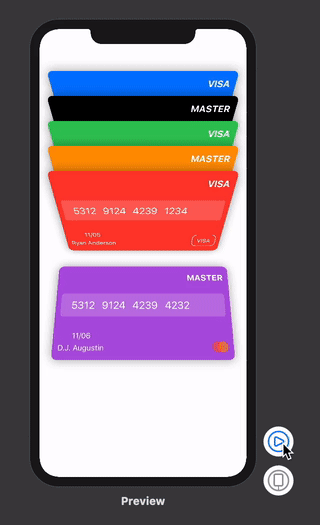

[View all](#swiftuicases)


---

SwiftUI shortcuts<br/>
Command + Option + Enter : Toggle the preview window<br/>
Command + Option + P : Refresh the preview window<br/>

<br/>
This page has 86 SwiftUI examples, and records the screenshots of all results here, hope to be helpful to you.<br/>
All examples are based on Xcode 11.1 for now.<br/>
Xcode 11 link: https://developer.apple.com/download/ <br/>
<br/>
ios development 426 tutorials on the App Store:<br/>
https://apps.apple.com/us/app/ios-development-426-tutorials/id1225080698?l=en<br/>

---

## Navigator：

* <span id="ExampleNavigator">Chapter 1: Views</span>
	- [First Project](#1FirstProject)
	- [Text-BasicStyle](#2Text-BasicStyle)
	- [3Text-Paragraph](#3Text-Paragraph)
	- [4Text-Padding](#4Text-Padding)
	- [5Text-FullScreen](#5Text-FullScreen)
	- [6Text-DateFormatter](#6Text-DateFormatter)
	- [7Text-Append](#7Text-Append)
	- [8TextField](#8TextField)
	- [9TextField-SecureField](#9TextField-SecureField)
	- [10Button](#10Button)
	- [11Button-sheet](#11Button-sheet)
	- [12Spacer](#12Spacer)
	- [13Divider](#13Divider)
	- [14Image-Basic](#14Image-Basic)
	- [15Image-Style](#15Image-Style)
	- [16Image-Processing](#16Image-Processing)
	- [17Image-Blend](#17Image-Blend)
	- [18Image-Mask](#18Image-Mask)
	- [19Image-Transform](#19Image-Transform)
	- [20Image-Web](#20Image-Web)
	- [21Picker](#21Picker)
	- [22PickerDate](#22PickerDate)
	- [23Slider](#23Slider)
	- [24Stepper](#24Stepper)
	- [25Segment](#25Segment)
	- [26Toggle](#26Toggle)
	- [27TabView](#27TabView)
	- [28Webview](#28Webview)
	- [29MapView](#29MapView)
	- [30Shape-Circle](#30Shape-Circle)
	- [31Shape-Rectangle](#31Shape-Rectangle)
	- [32Shape-Path](#32Shape-Path)
	- [33GradientLinear](#33GradientLinear)
	- [34GradientAngular](#34GradientAngular)
	- [35GradientRadial](#35GradientRadial)
	<br/>

* <span id="Chapter2">Chatper 2: Animation</span>
	- [1scaleEffect+default](#1scaleEffect+default)
	- [2Opacity+linear](#2Opacity+linear)
	- [3Offset+easeOut](#3Offset+easeOut)
	- [4RotationEffect+spring](#4RotationEffect+spring)
	- [5CombinedAnimation](#5CombinedAnimation)
	- [6SpeadAndDelay](#6SpeadAndDelay)
	- [7Repeating](#7Repeating)
	- [8ToggleVisibility](#8ToggleVisibility)
	- [9AsymmetricTransition](#9AsymmetricTransition)
	<br/>

* <span id="Chapter3">Chapter 3: Gesture</span>
	- [1TapGesture+Single tap](#1TapGesture+Singletap)
	- [2TapGesture+Double tap](#2TapGesture+Doubletap)
	- [3LongPressGesture](#3LongPressGesture)
	- [4RotationGesture](#4RotationGesture)
	- [5DragGesture](#5DragGesture)
	- [6LongPressGestureAndDragGesture](#6LongPressGestureAndDragGesture)
	<br/>

* <span id="Chapter4">Chapter 4: Layout</span>
	- [1Group](#1Group)
	- [2HSTack](#2HSTack)
	- [3VSTack](#3VSTack)
	- [4ZSTack](#4ZSTack)
	- [5List-Basic](#5List-Basic)
	- [6List-Insert](#6List-Insert)
	- [7List-Delete](#7List-Delete)
	- [8List-Move](#8List-Move)
	- [9List-DeleteAndMove](#9List-DeleteAndMove)
	- [10ScrollView-Vertical](#10ScrollView-Vertical)
	- [11ScrollView-Horizontal](#11ScrollView-Horizontal)
	- [12ScrollView-VerticalAndHorizontal](#12ScrollView-VerticalAndHorizontal)
	- [13Form-Basic](#13Form-Basic)
	- [14Form-Segment](#14Form-Segment)
	- [15Form-EnableDisable](#15Form-EnableDisable)
	- [16Form-ShowHide](#16Form-ShowHide)
	<br/>

* <span id="Chapter5">Chapter 5: DataFlow</span>
	- [1NavigationLink](#1NavigationLink)
	- [2NavigationLinkAndGoBack](#2NavigationLinkAndGoBack)
	- [3PageNavigation](#3PageNavigation)
	- [4ObjectBinding](#4ObjectBinding)
	- [5EnviromentObject](#5EnviromentObject)
	- [6Show_Modal](#6Show_Modal)
	- [7Show-Alert](#7Show-Alert)
	- [8Show-ActionSheet](#8Show-ActionSheet)
	<br/>

* <span id="Chapter6">Chapter 6: More</span>
	- [1PreviewInNavigationView](#1PreviewInNavigationView)
	- [2Background](#2Background)
	- [3SizeCategory](#3SizeCategory)
	- [4PreviewDevice](#4PreviewDevice)
	- [5ViewAsProperties](#5ViewAsProperties)
	- [6onAppear-onDisappear](#6onAppear-onDisappear)
	- [7ColorScheme-LightAndDark](#7ColorScheme-LightAndDark)
	- [8AnyView](#8AnyView)
	- [9NavigationBarTitle](#9NavigationBarTitle)
	- [10NavigationItem](#10NavigationItem)
	- [11ViewModifier](#11ViewModifier)
	<br/>
	
* <span id="Chapter7">Chapter 6: Projects by SwiftUI</span>
	- [View all](#swiftuicases)
	
# Chapter 1: Views<br/>
<h4 id="1FirstProject"> 1、How to create a SwiftUI project: <h4>
1、Open Xcode, choose File > New > Project.<br/>
2、Choose Single View App template and click Next.<br/>
3、Select SwiftUI checkbox, and then click Next.<br/>
4、Here you get the SwiftUI project<br/>
	
 

<br/>
5. Project navigator<br/>

<table>
	<thead>
		<tr>
			<th>File name</th>
			<th>Comment</th>
		</tr>
	</thead>
	<tbody>
		<tr>
			<td>AppDelegate.swift</td>
			<td>Override point for customization after application launch.</td>
		</tr>
		<tr>
			<td>SceneDelegate.swift</td>
			<td>Use func scene(_ scene: UIScene, willConnectTo session: UISceneSession, options connectionOptions: UIScene.ConnectionOptions) to optionally configure and attach the UIWindow `window` to the provided UIWindowScene `scene`.</td>
		</tr>
		<tr>
			<td>ContentView.swift</td>
			<td>The initial interface of the project, the visual views on the user interface can be placed in this file.</td>
		</tr>
		<tr>
			<td>Assets.xcassets</td>
			<td>Here you can place images, colors or other resources in this folder.</td>
		</tr>
		<tr>
			<td>LaunchScreen.storyboard</td>
			<td>Used to configure what is displayed during project startup.</td>
		</tr>
		<tr>
			<td>Info.plist</td>
			<td>The configuration property file of the project, including the product name, version number, build number, Bundle Identifier and other items.</td>
		</tr>
	</tbody>
</table>

6、Editor:<br/>
<ul>
  <li>SwiftUI uses a declarative syntax so you can simply state what your user interface should do. </li>
  <li>For example, you can write that you want a list of items consisting of text fields, then describe alignment, font, and color for each field. </li>
  <li>Your code is simpler and easier to read than ever before, saving you time and maintenance.</li>
</ul>
<br/>
7、ContentView.swift:<br/>

```swift
//import SwiftUI framework
import SwiftUI 		             

//By default, SwiftUI view files declare two structures. 
//The first structure conforms to the View protocol and describes the view’s content and layout. 
struct ContentView: View {		 
//
    var body: some View {
    	//Show something on the screen.
        Text("Hello World")
    }
}

//Running when debugging
#if DEBUG
//The second structure declares a preview for that view.
struct ContentView_Previews: PreviewProvider {
//overrid the previews of PreviewProvider protocol
    static var previews: some View {
    	//Show the content on the preview window
        ContentView()
    }
}
#endif
```

8、SceneDelegate.swift<br/>

```swift
//Use this method to optionally configure and attach the UIWindow `window` to the provided UIWindowScene `scene`.
func scene(_ scene: UIScene, willConnectTo session: UISceneSession, options connectionOptions: UIScene.ConnectionOptions) {

        if let windowScene = scene as? UIWindowScene {
	    //Create a new window
            let window = UIWindow(windowScene: windowScene)
	    // Initialize a new UIHostingController, and set it as the rootViewController of the window.
            window.rootViewController = UIHostingController(rootView: ContentView())
	    // assign the window object to the window of the application
            self.window = window
	    // show the window
            window.makeKeyAndVisible()
        }
    }
```

[](#ExampleNavigator)


<h4 id="2Text-BasicStyle"> 2: Text-BasicStyle </h4>
A view that displays one or more lines of read-only text.<br/>
Code:<br/>

```swift
VStack{
    //Basic style
    Text("www.hdjc8.com")
	.bold()

    Text("www.hdjc8.com")
	.italic()

    Text("www.hdjc8.com")
	.underline()

    Text("www.hdjc8.com")
	.underline(true, color: .orange)

    Text("www.hdjc8.com")
	.strikethrough()

    Text("www.hdjc8.com")
	.strikethrough(true, color: .orange)

    Text("www.hdjc8.com")
	.foregroundColor(Color.orange)

    Text("www.hdjc8.com")
	.baselineOffset(CGFloat(5.0))
	.background(Color.orange)

     Text("www.hdjc8.com")
	 .background(Image("Picture"), alignment: .bottom)

    //Font
    VStack{
	Text("www.hdjc8.com")
	    .font(.footnote)

	Text("www.hdjc8.com")
	    .font(.system(size: 36))

	Text("www.hdjc8.com")
	    .font(.system(.title, design: .monospaced))

	Text("www.hdjc8.com")
	    .font(.custom("BradleyHandITCTT-Bold", size: 36))

	Text("www.hdjc8.com")
	    .fontWeight(Font.Weight.heavy)

	Text("www.hdjc8.com")
	    .fontWeight(Font.Weight.ultraLight)

    }
}
```

<details close>
  <summary>View the result</summary>
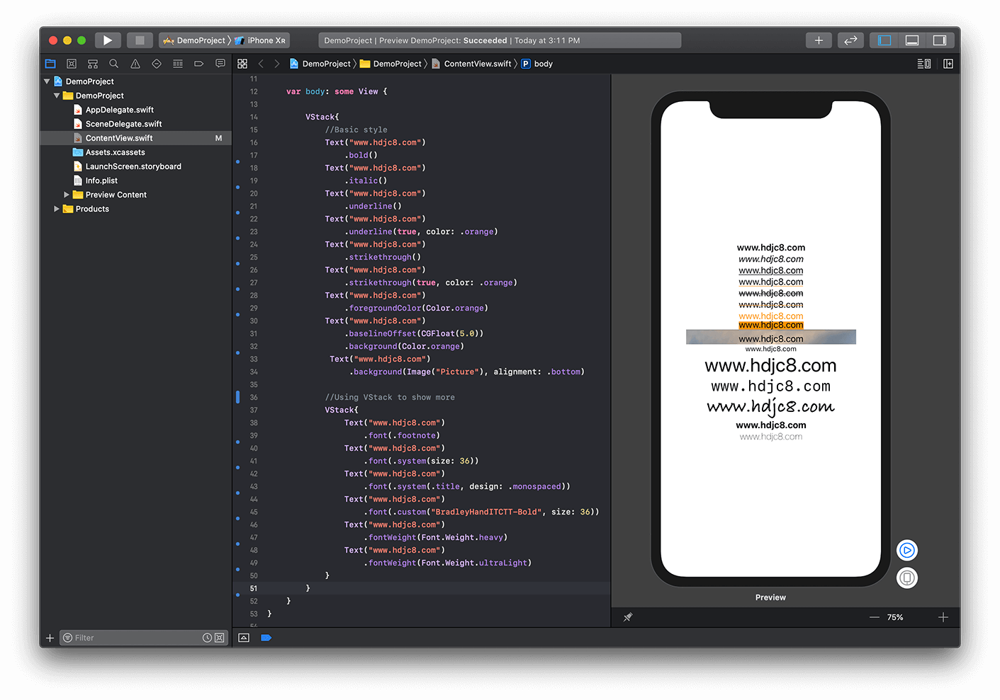
</details>

[](#ExampleNavigator)


<h4 id="3Text-Paragraph"> 3: Text-Paragraph </h4>
<br/>
Code:<br/>

```swift
VStack{

    Text("www.hdjc8.com")

    Text("www.hdjc8.com")
	.tracking(10)

    Text("www.hdjc8.com")
	.kerning(10)

    Text("www.hdjc8.com")
	.blur(radius: 1)

    Text("SwiftUI is an innovative, exceptionally simple way to build user interfaces across all Apple platforms with the power of Swift.")
	.lineSpacing(20)
//                .lineLimit(1)
	.lineLimit(nil)

    Text("www.hdjc8.com")
	.offset(x: 40, y: 0)

    Text("www.hdjc8.com")
	.frame(width: 200, height: 80, alignment: .bottomTrailing)
	.background(Color.orange)

    VStack{
	Text("www.hdjc8.com2")
	    .position(x: 50, y: 50)
	    .frame(width: 300, height: 100, alignment: .bottomTrailing)
	    .background(Color.orange)

	Text("Interactive\ntutorials\nfor\nXcode!")
	    .multilineTextAlignment(.center)
	    .lineLimit(4)

	Text("Hello\nInteractive Tutorials!").multilineTextAlignment(.leading)
    }

}
```

<details close>
  <summary>View the result</summary>
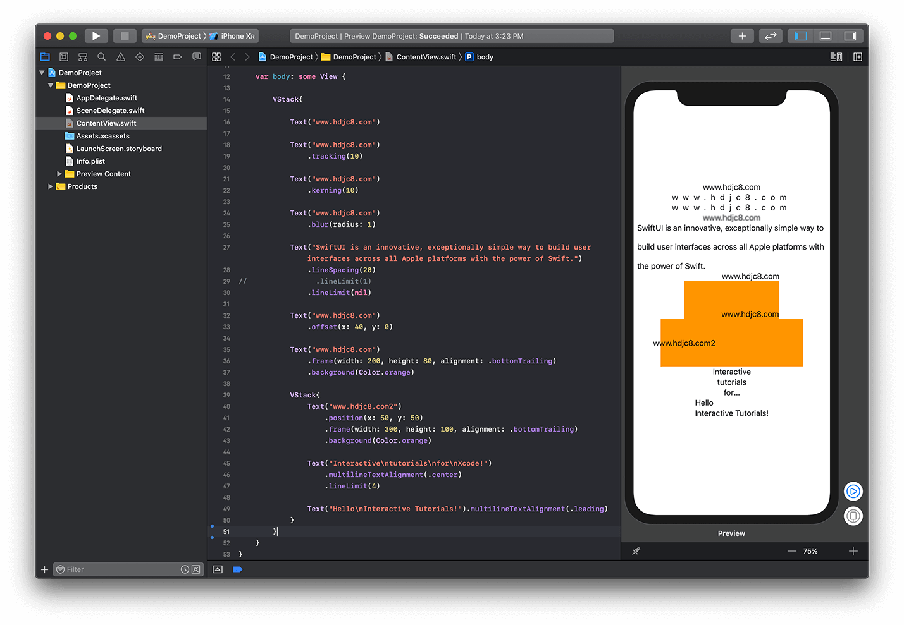
</details>


[](#ExampleNavigator)


<h4 id="4Text-Padding"> 4: Text-Padding </h4>
br/>
Code:<br/>

```swift
VStack{
    Text("www.hdjc8.com")
	.background(Color.black)
	.foregroundColor(.white)
	.padding(20)

    Text("www.hdjc8.com")
	.padding()
	.background(Color.black)
	.foregroundColor(.white)

    Text("Swift User Interface")
	.font(.largeTitle)
	.foregroundColor(.black)
	.padding(15)
	.background(Color.yellow)
	.padding(15)
	.background(Color.orange)
	.padding(10)
	.background(Color.red)
}
```

<details close>
  <summary>View the result</summary>
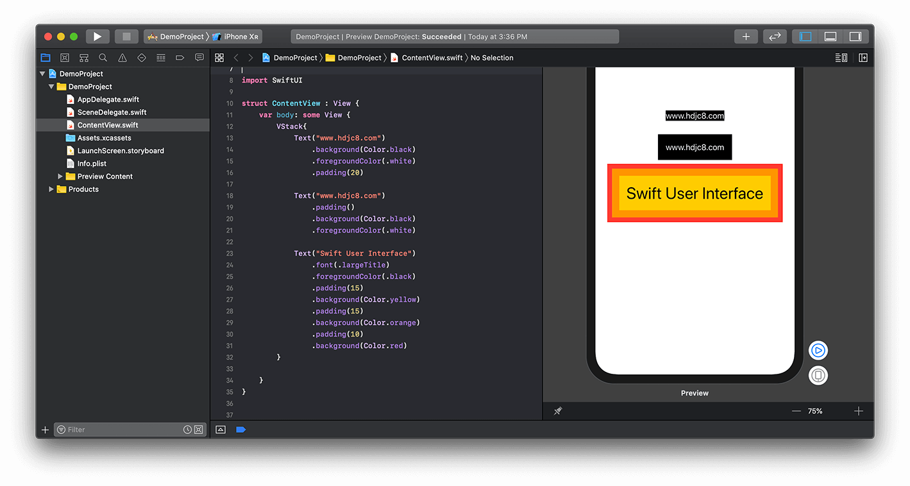
</details>

[](#ExampleNavigator)


<h4 id="5Text-FullScreen"> 5: Text-FullScreen </h4>
<br/>
Code:<br/>

```swift
Text("Hello World")
    .frame(minWidth: 0, maxWidth: .infinity, minHeight: 0, maxHeight: .infinity)
    .background(Color.orange)
    .font(.largeTitle)
    .edgesIgnoringSafeArea(.all)
```

<details close>
  <summary>View the result</summary>
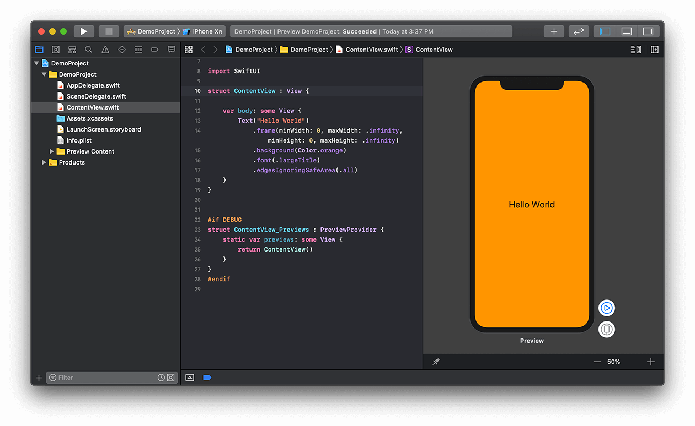
</details>

[](#ExampleNavigator)


<h4 id="6Text-DateFormatter"> 6: Text-DateFormatter </h4>
<br/>
Code:<br/>

```swift
var now = Date()
static let dateFormatter: DateFormatter = {
let formatter = DateFormatter()
formatter.dateStyle = .long
return formatter
}()

var body: some View {

Text("The time is: \(now, formatter: Self.dateFormatter)")
    .font(.title)
    .padding()

}
```

<details close>
  <summary>View the result</summary>
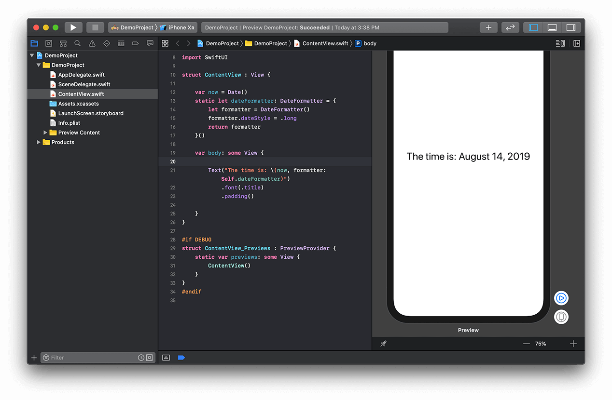
</details>

<h4 id="7Text-Append"> 7: Text-Append </h4>
<br/>
Code:<br/>

```swift
Text("Interactive ")
    .foregroundColor(.yellow)
    .fontWeight(.heavy)
+ Text("tutorials ")
    .foregroundColor(.orange)
    .strikethrough()
+ Text("for ")
    .foregroundColor(.red)
    .italic()
+ Text("SwiftUI")
    .foregroundColor(.purple)
    .underline()
```

<details close>
  <summary>View the result</summary>
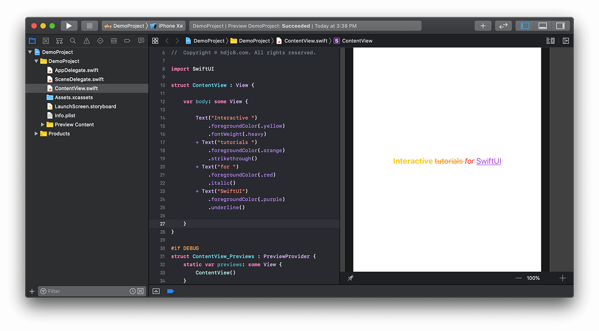
</details>

[](#ExampleNavigator)

<h4 id="8TextField"> 8: TextField </h4>
A control that displays an editable text interface.<br/>
Code:<br/>

```swift
struct ContentView : View {
    
    @State var username : String
    @State var nickname : String
    
    var body: some View {
        
        VStack{
            
            Text("Your username is \(username)!")
            
            Text("Your nickname is \(nickname)!")
            
            TextField("User Name", text: $username, onEditingChanged: { (value) in
                print("onEditingChanged:\(self.username)")
            }) {
                print("onCommit:\(self.username)")
            }.textFieldStyle(RoundedBorderTextFieldStyle())
            
            TextField("Nick Name", text: $nickname)
                .textFieldStyle(RoundedBorderTextFieldStyle())
            
        }
        .padding()
        
    }
}

#if DEBUG
struct ContentView_Previews : PreviewProvider {
    
    static var previews: some View {
        ContentView(username: "", nickname: "")
    }
}
#endif
```

<details close>
  <summary>View the result</summary>
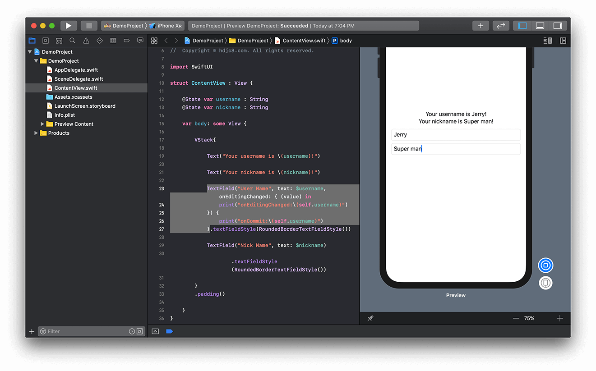
</details>

[](#ExampleNavigator)

<h4 id="9TextField-SecureField"> 9: TextField-SecureField </h4>
A control into which the user securely enters private text.<br/>
Code:<br/>

```swift
struct ContentView : View {
    
    @State var password : String
    
    var body: some View {
        
        VStack{
            
            Text("Your password is \(password)!")
            
            SecureField("Your password", text: $password) {
                print("Your password is \(self.password)!")
            }
            .textFieldStyle(RoundedBorderTextFieldStyle())
            
        }
        .padding()
        
    }
}
```

<details close>
  <summary>View the result</summary>
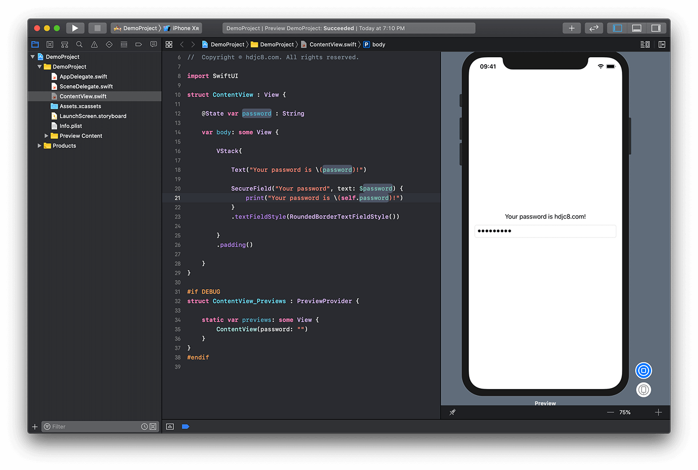
</details>

[](#ExampleNavigator)

<h4 id="10Button"> 10: Button </h4>
A control that performs an action when triggered.<br/>
Code:<br/>

```swift
VStack{

    Button("First button") {
	print("---First button action.")
    }

    Button(action: {
	print("---Second button action.")
    }) {
	Text("Second button")
    }

    Button(action: {
	print("---Third button action.")
    }) {
	Image(systemName: "clock")
	Text("Third button")
    }
    .foregroundColor(Color.white)
    .background(Color.orange)

    //padding for button : the tap area is wrong
    Button(action: {
	print("---padding for button.")
    }){
	Text("Default padding")
    }
    .padding()
    .background(Color.yellow)

    //padding for label : the tap area is correct!
    Button(action: {
	print("---padding for label.")
    }){
	Text("Default padding")
	    .padding()
	    .background(Color.yellow)
    }

    Button(action: {
	print("---Button with image.")
    }){
	HStack {
	    Image(systemName: "star")
	    Text("Button with image")
	}
	.padding()
	    .background(Color.yellow)
    }
    Button(action: {
	print("---modifier button")
    }){
	Text("modifier button")
	    .modifier(MyButtonStyle())
    }
}
```

<details close>
  <summary>View the result</summary>

</details>

[](#ExampleNavigator)

<h4 id="11Button-sheet"> 11: Button-sheet </h4>
<br/>
Code:<br/>

```swift
struct ContentView : View {

    @State var isPresented = false
    
    var body: some View {
        VStack{
            Button("Show modal") {
                self.isPresented = true
            }.sheet(isPresented: $isPresented, content: {
                MyDetailView(message: "Modal window")
            })
        }
    }
}

struct MyDetailView: View {
    let message: String

    var body: some View {
        VStack {
            Text(message)
                .font(.largeTitle)
        }
    }
}
```

<details close>
  <summary>View the result</summary>
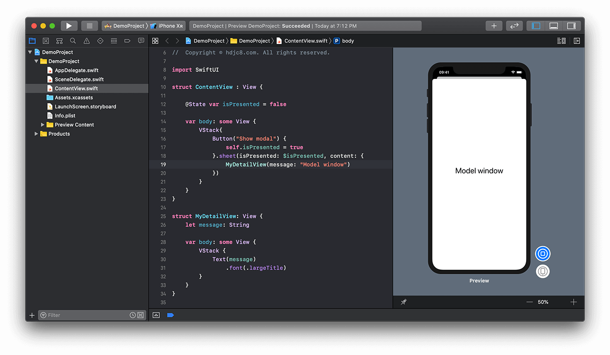
</details>

[](#ExampleNavigator)


<h4 id="12Spacer"> 12: Spacer </h4>
A flexible space that expands along the major axis of its containing stack layout, or on both axes if not contained in a stack.<br/>
Code:<br/>

```swift
var body: some View {
        VStack{
            HStack {
                Image(systemName: "clock")
                Spacer()
           }
           .padding()
        
           HStack {
                Image(systemName: "clock")
                Spacer()
                Text("\(Date())")
           }
           .padding()
        
            HStack {
                 Image(systemName: "clock")
                 Spacer(minLength: 50)
                 Text("\(Date())")
            }
            .padding()
        }
    }
```

<details close>
  <summary>View the result</summary>
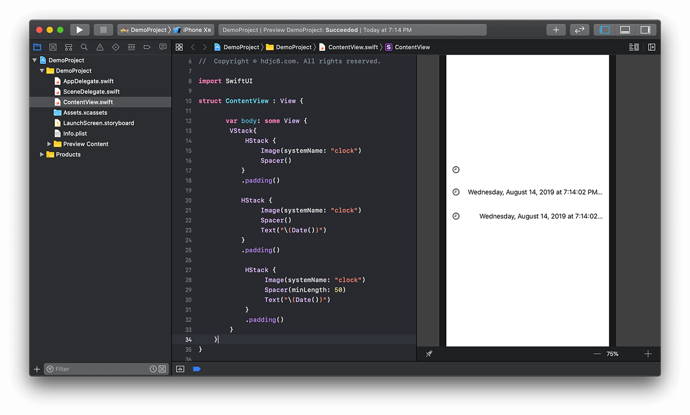
</details>

[](#ExampleNavigator)


<h4 id="13Divider"> 13: Divider </h4>
When contained in a stack, the divider extends across the minor axis of the stack, or horizontally when not in a stack.<br/>
Code:<br/>

```swift
VStack{
    VStack {
	 Image(systemName: "clock")
	 Divider()
	 Text("\(Date())")
    }
    .padding()

    VStack {
	 Image(systemName: "clock")
	 Divider()
	    .background(Color.purple)
	    .scaleEffect(CGSize(width: 1, height: 10))
	 Text("\(Date())")
    }
    .padding()
}
```

<details close>
  <summary>View the result</summary>
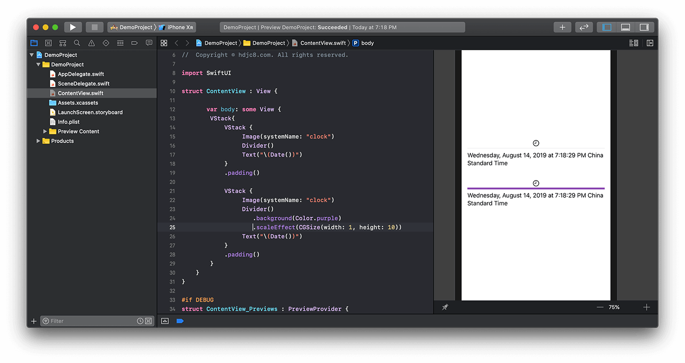
</details>

[](#ExampleNavigator)


<h4 id="14Image-Basic"> 14: Image-Basic </h4>
A view that displays an environment-dependent image.<br/>
Code:<br/>

```swift
VStack{
            
    Image("girlPicture")

    Image(systemName: "arkit")
	.foregroundColor(.orange)
	.font(.system(size: 48))

    Image("girlPicture")
	.resizable()
	.aspectRatio(contentMode: .fit)
}
.padding()
```

<details close>
  <summary>View the result</summary>
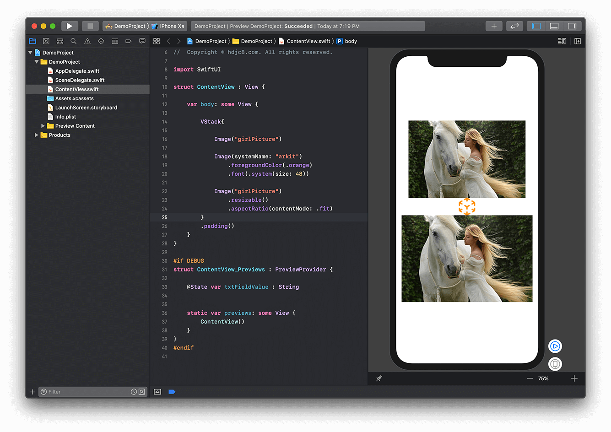
</details>

[](#ExampleNavigator)


<h4 id="15Image-Style"> 15: Image-Style </h4>
<br/>
Code:<br/>

```swift
ScrollView{
     VStack{

	Image("girlPicture")
	    .border(Color.orange)

	Image("girlPicture")
	    .border(Color.orange, width: 10)

	Image("girlPicture")
	    .opacity(0.5)

	Image("girlPicture")
	    .shadow(radius: 10)

	Image("girlPicture")
	    .shadow(color: .purple, radius: 20, x: 20, y: 20)
    }
}
```

<details close>
  <summary>View the result</summary>
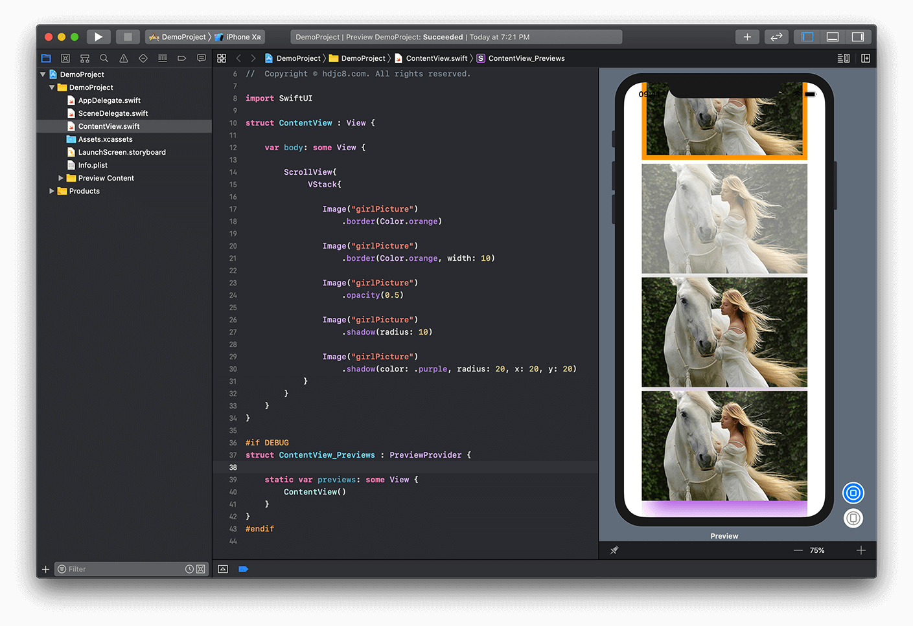
</details>

[](#ExampleNavigator)


<h4 id="16Image-Processing"> 16: Image-Processing </h4>
<br/>
Code:<br/>

```swift
ScrollView{
     VStack{
	Image("girlPicture")

	Image("girlPicture")
	    .blur(radius: CGFloat(2))

	Image("girlPicture")
	    .blur(radius: CGFloat(2), opaque: true)

	Image("girlPicture")
	    .brightness(0.2)

	Image("girlPicture")
	    .colorInvert()

	Image("girlPicture")
	    .colorMultiply(Color.yellow)

	Image("girlPicture")
	    .contrast(1.5)
    }

    VStack{
	Image("girlPicture")
	    .hueRotation(Angle.degrees(180))

	Image("girlPicture")
	    .saturation(10)

	Image("girlPicture")
	    .grayscale(5.5)

	Image("girlPicture")
	    .luminanceToAlpha()
    }
}
```

<details close>
  <summary>View the result</summary>
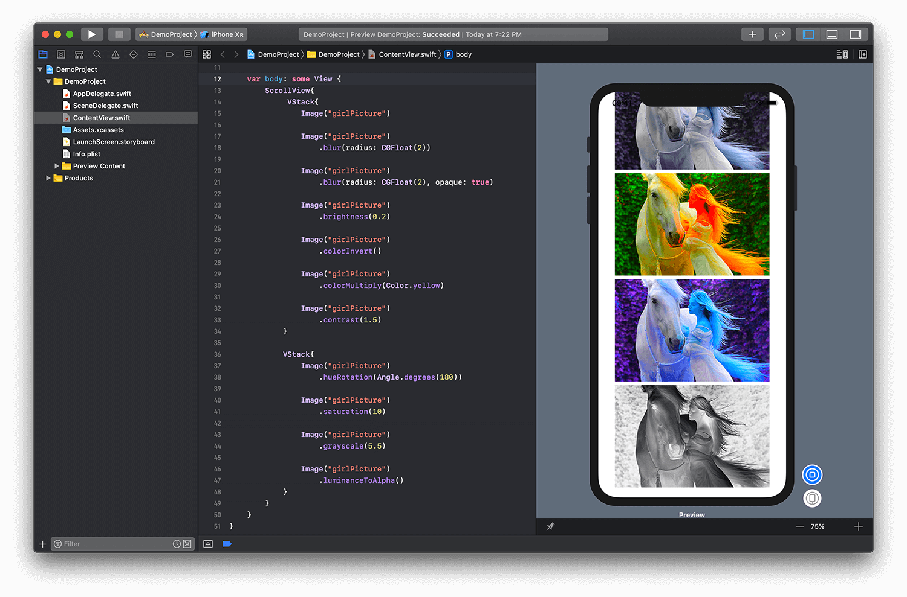
</details>

[](#ExampleNavigator)


<h4 id="17Image-Blend"> 17: Image-Blend </h4>
<br/>
Code:<br/>

```swift
VStack{
            
    Image("girlPicture")
	.blendMode(.difference)

    ZStack{
	Image("texture")
	Image("girlPicture")
	    .blendMode(.multiply)
    }
}
.padding()
```

<details close>
  <summary>View the result</summary>
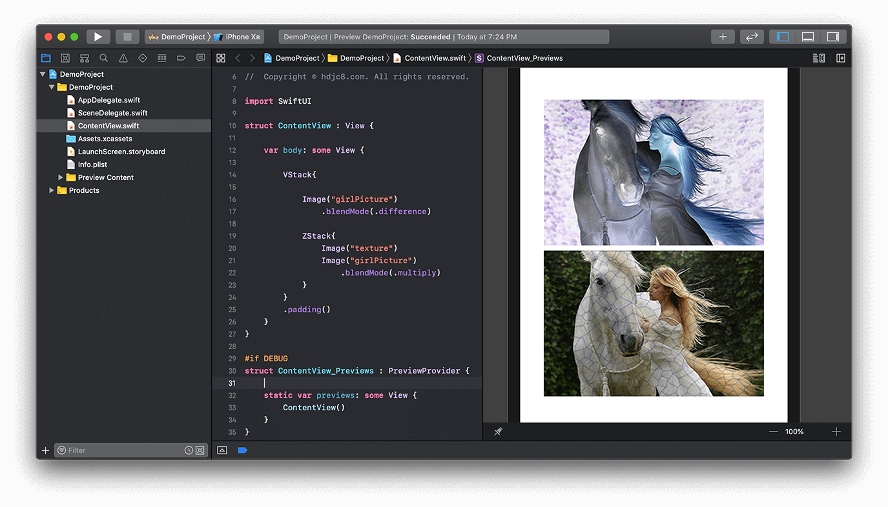
</details>

[](#ExampleNavigator)


<h4 id="18Image-Mask"> 18: Image-Mask </h4>
<br/>
Code:<br/>

```swift
VStack{

    Image("girlPicture")
	.clipShape(Circle())

    Image("girlPicture")
	.mask(Circle())

    Image("texture")
    .resizable()
    .frame(width: 300, height: 300)
    .mask(
	Text("SWIFT UI!")
	    .font(Font.system(size: 64).bold()))

}
```

<details close>
  <summary>View the result</summary>
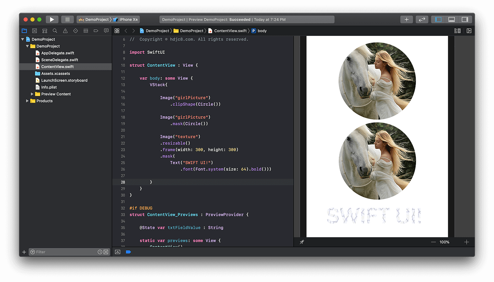
</details>

[](#ExampleNavigator)


<h4 id="19Image-Transform"> 19: Image-Transform </h4>
<br/>
Code:<br/>

```swift
ScrollView{
            
    VStack{
	Image("girlPicture")
	    .scaleEffect(0.8)

	Image("girlPicture")
	    .scaleEffect(CGSize(width: 1.2, height: 1))

	Image("girlPicture")
	    .scaleEffect(x: 1.5, y: 1, anchor: UnitPoint.bottomLeading)
    }

     VStack{

	Image("girlPicture")
	     .rotationEffect(Angle.init(degrees: 90))

	Image("girlPicture")
	    .rotationEffect(Angle.init(degrees: 30), anchor: UnitPoint.init(x: 0, y: 0))

	Image("girlPicture")
	    .rotation3DEffect(Angle.init(degrees: 30), axis: (x: CGFloat(0.1), y: CGFloat(0.1), z: CGFloat(0)))

    }
}
```

<details close>
  <summary>View the result</summary>
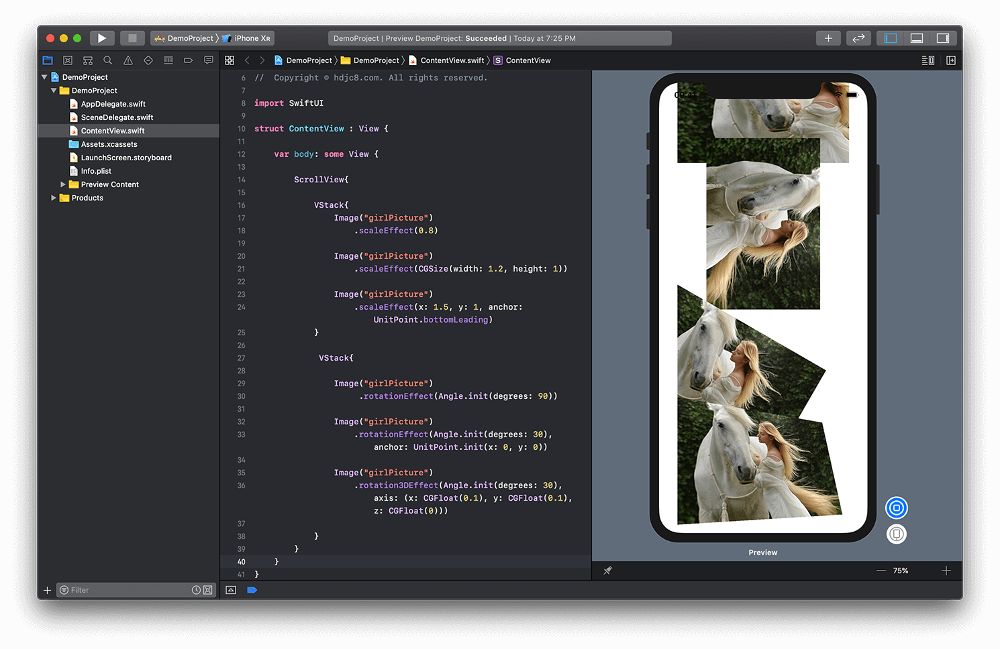
</details>

[](#ExampleNavigator)


<h4 id="20Image-Web"> 20: Image-Web </h4>
<br/>
Code:<br/>

```swift
struct ContentView : View {
    
    @State private var remoteImage : UIImage? = nil
    let placeholderOne = UIImage(named: "Picture")
    
    var body: some View {
        Image(uiImage: self.remoteImage ?? placeholderOne!)
            .onAppear(perform: fetchRemoteImage)
    }
    
    func fetchRemoteImage()
    {
        guard let url = URL(string: "http://hdjc8.com/images/logo.png") else { return }
        URLSession.shared.dataTask(with: url){ (data, response, error) in
            if let image = UIImage(data: data!){
                self.remoteImage = image
            }
            else{
                print(error ?? "")
            }
        }.resume()
    }
}
```

<details close>
  <summary>View the result</summary>
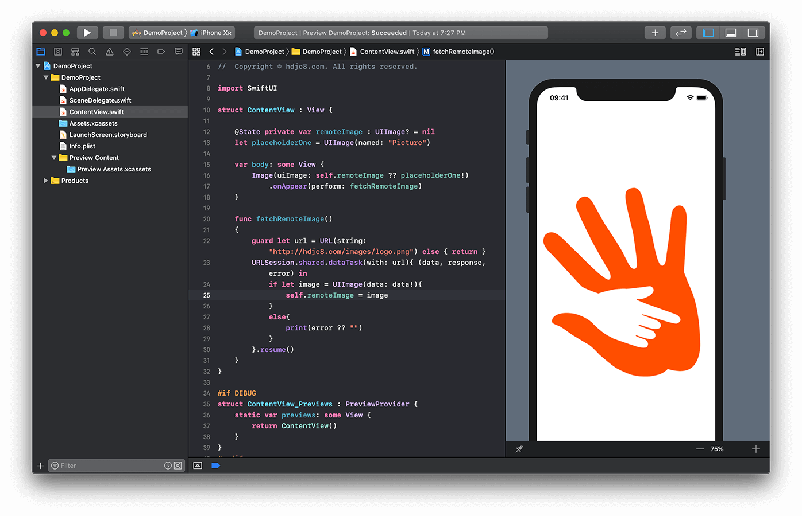
</details>

[](#ExampleNavigator)


<h4 id="21Picker"> 21: Picker </h4>
A control for selecting from a set of mutually exclusive values.<br/>
Code:<br/>

```swift
struct ContentView : View {
    
     var fruits = ["Apple", "Banner", "Pear", "Watermelon"]
     var colors = [Color.blue, Color.orange, Color.red, Color.purple]
     @State private var selectedItem = 0

     var body: some View {
        VStack {
            
           Picker(selection: $selectedItem, label: Text("Fruits")) {
              ForEach(0 ..< fruits.count) {
                Text(self.fruits[$0]).tag($0).foregroundColor(self.colors[$0])
              }
           }
           Text("Your choice: ")
            + Text("\(fruits[selectedItem])").foregroundColor(self.colors[selectedItem])
        }
     }
}

```

<details close>
  <summary>View the result</summary>
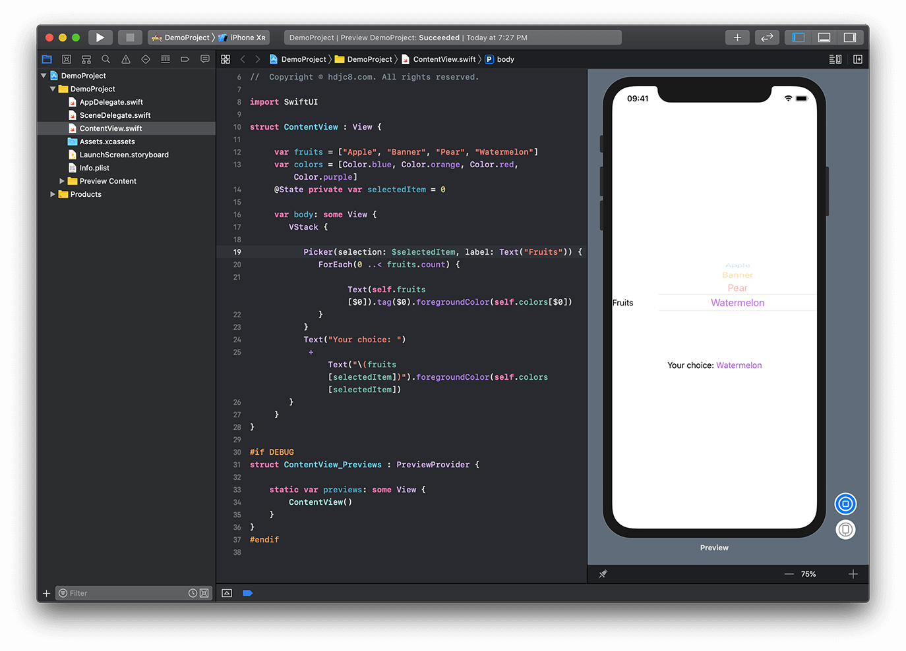
</details>

[](#ExampleNavigator)


<h4 id="22PickerDate"> 22: DatePicker </h4>
A control for selecting an absolute date.<br/>
Code:<br/>

```swift
struct ContentView : View {
    var myDateFormatter: DateFormatter {
        let formatter = DateFormatter()
        formatter.dateStyle = .long
        return formatter
    }

    @State var selectedDate = Date()

    var body: some View {
        VStack {
            DatePicker(selection: $selectedDate, displayedComponents: DatePickerComponents.hourAndMinute) {
                Text("Date")
            }
            
            DatePicker(selection: $selectedDate, displayedComponents: DatePickerComponents.date) {
                Text("Date")
            }

            DatePicker(selection: $selectedDate,in: Date()...Date().advanced(by: 7*24*3600), displayedComponents: [.date, .hourAndMinute]) {
                Text("Date")
            }

            Text("Your Choice: \(selectedDate, formatter: myDateFormatter)")
        }
    }
}
```

<details close>
  <summary>View the result</summary>
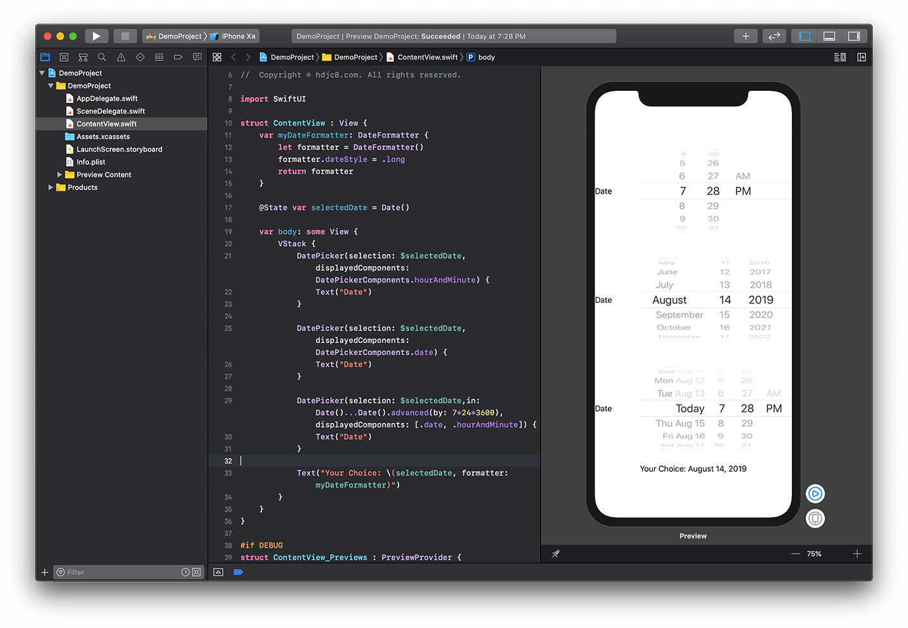
</details>

[](#ExampleNavigator)


<h4 id="23Slider"> 23: Slider </h4>
A control for selecting a value from a bounded linear range of values.<br/>
Code:<br/>

```swift
struct ContentView : View {
    
     @State var temperature: Double = 0

       var body: some View {
           VStack {
                Slider(value: $temperature)
                Slider(value: $temperature, in: -20...40)
                Slider(value: $temperature, in: -20...40) { (item) in
                    print(item)
                }
                HStack{
                    Image(systemName: "sun.max")

                    Slider(value: $temperature, in: -20...40, step: 2) { (item) in
                        print(item)
                    }.accentColor(.pink).colorInvert()
                    
                   Image(systemName: "sun.max.fill")
                }.padding()

                Text("The temperature is \(Int(temperature)).")
           }
       }
}
```

<details close>
  <summary>View the result</summary>

</details>

[](#ExampleNavigator)


<h4 id="24Stepper"> 24: Stepper </h4>
A control used to perform semantic increment and decrement actions.<br/>
Code:<br/>

```swift
struct ContentView : View {
    
     @State var temperature: Double = 0

       var body: some View {
        
           VStack {
                Stepper(onIncrement: {
                    self.temperature += 1
                }, onDecrement: {
                    self.temperature -= 1
                }, label: { Text("Temperature: \(Int(temperature))") })
                
                Stepper(onIncrement: {
                    self.temperature += 1
                }, onDecrement: {
                    self.temperature -= 1
                }, onEditingChanged: { (item) in
                    print(item)
                }, label: { Text("Temperature: \(Int(temperature))") })
           
       }.padding()
    }
}
```

<details close>
  <summary>View the result</summary>
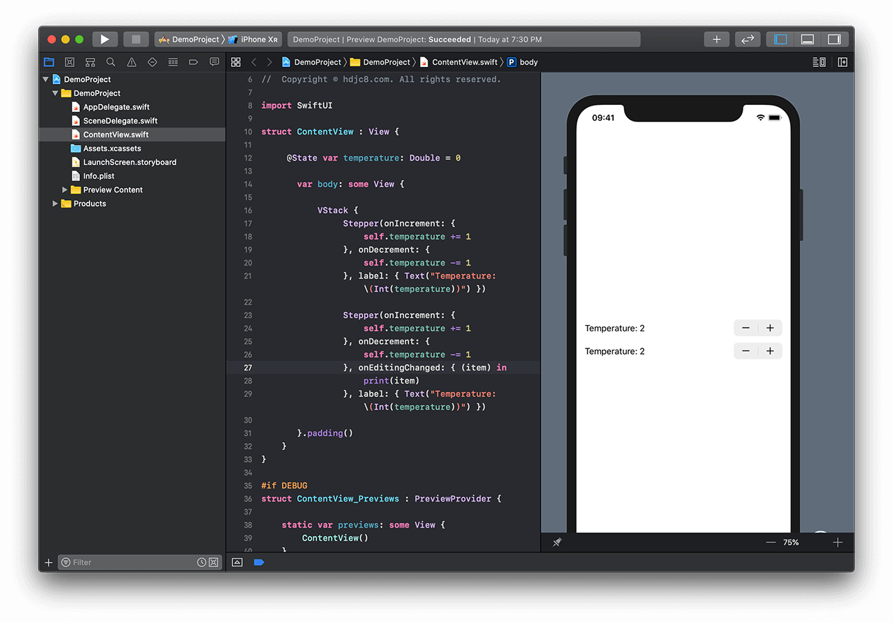
</details>

[](#ExampleNavigator)


<h4 id="25Segment"> 25: Segment </h4>
A control for selecting from a set of options.<br/>
Code:<br/>

```swift
struct ContentView : View {
    
    private var animals = ["🐶 Dog", "🐯 Tiger", "🐷 Pig"]
    var colors = [Color.yellow, Color.orange, Color.red, Color.purple]
    @State private var selectedAnimal = 0

    var body: some View {
        VStack {
            Picker(selection: $selectedAnimal, label: Text("animals")) {
               ForEach(0 ..< animals.count) {
                Text(self.animals[$0]).tag($0)
               }
            }.pickerStyle(SegmentedPickerStyle())
            Text("Your choice: \(animals[selectedAnimal])")
        }
    }
}
```

<details close>
  <summary>View the result</summary>
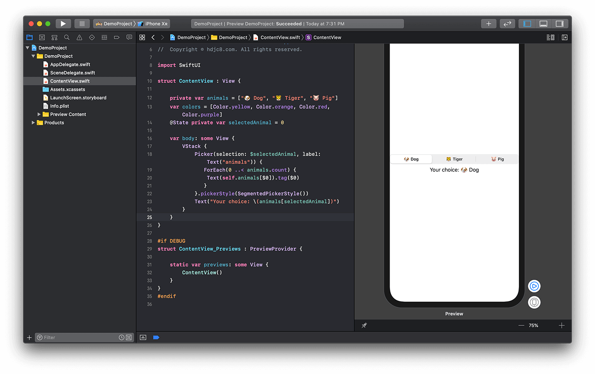
</details>

[](#ExampleNavigator)


<h4 id="26Toggle"> 26: Toggle </h4>
A control that toggles between on and off states.<br/>
Code:<br/>

```swift
struct ContentView : View {
    @State var showNotification = true

    var body: some View {
        VStack {
            Text("Show Notification: ")
            + Text("\(self.showNotification.description)")
                .foregroundColor(.green)
                .bold()
                
            
            Toggle(isOn: $showNotification) {
                Text("Show notification:")
            }.padding()
        }
    }
}
```

<details close>
  <summary>View the result</summary>
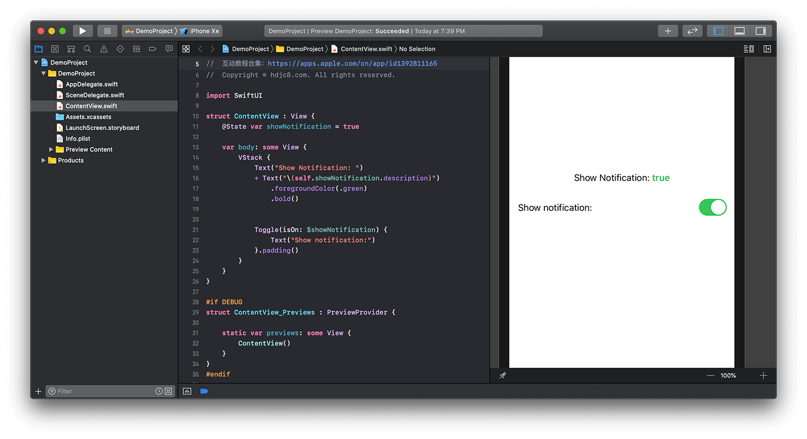
</details>

[](#ExampleNavigator)


<h4 id="27TabView"> 27: TabView </h4>
A view that switches between multiple child views using interactive user interface elements.<br/>
Code:<br/>

```swift
var body: some View {
	TabView {
	    Text("The home page.")
		.font(.system(size: 36))
		.tabItem({
		    Image(systemName: "house")
		    Text("Home") })
		.tag(0)

	    Text("The settings page")
		.font(.system(size: 36))
		.tabItem({
		    Image(systemName: "gear")
		    Text("Settings")
		})
		.tag(1)
	}
    }
```

<details close>
  <summary>View the result</summary>
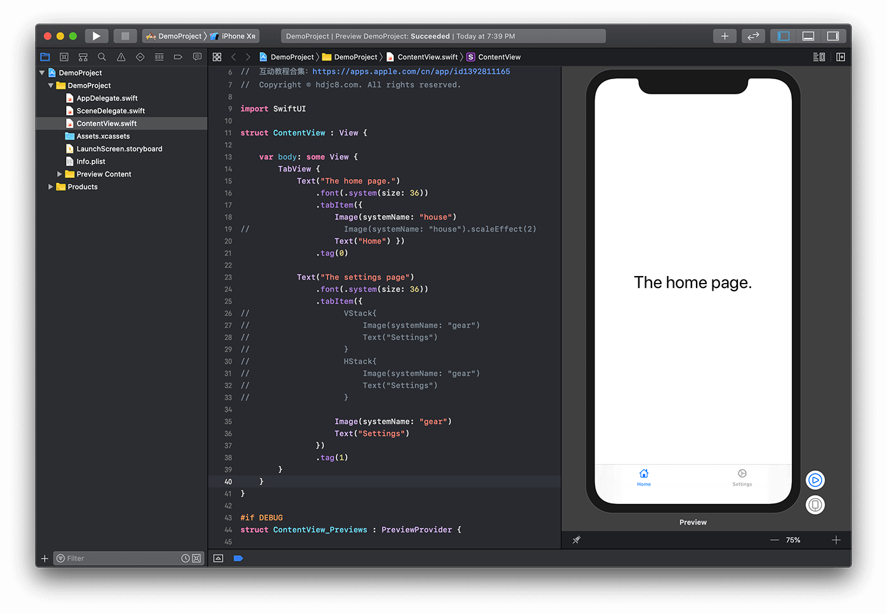
</details>

[](#ExampleNavigator)


<h4 id="28Webview"> 28: How to import WKWebview from UIKit </h4>
<br/>
Code:<br/>

```swift
import SwiftUI
import WebKit

struct ContentView : UIViewRepresentable {
    
    func makeUIView(context: UIViewRepresentableContext<ContentView>) -> WKWebView {
        return WKWebView()
    }
    
    func updateUIView(_ uiView: WKWebView, context: UIViewRepresentableContext<ContentView>) {
        let request = URLRequest(url:URL(string: "https://apple.com")!)
        uiView.load(request)
    }
}
```

<details close>
  <summary>View the result</summary>
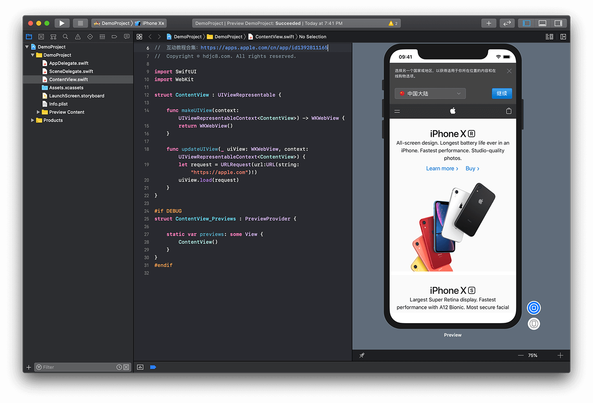
</details>

[](#ExampleNavigator)


<h4 id="29MapView"> 29: How to import MKMapView from UIKit </h4>
<br/>
Code:<br/>

```swift
import SwiftUI
import MapKit

struct ContentView : UIViewRepresentable {
    
    func makeUIView(context: UIViewRepresentableContext<ContentView>) -> MKMapView {
        return MKMapView()
    }
    
    func updateUIView(_ uiView: MKMapView, context: UIViewRepresentableContext<ContentView>) {
        uiView.showsUserLocation = true
        uiView.mapType = MKMapType.satellite
        
        let coordinate2D = CLLocationCoordinate2D(latitude: 39.915352, longitude: 116.397105)
        let zoomLevel = 0.02
        let region = MKCoordinateRegion(center: coordinate2D, span: MKCoordinateSpan(latitudeDelta: zoomLevel, longitudeDelta: zoomLevel))
        uiView.setRegion(uiView.regionThatFits(region), animated: true)
    }
}
```

<details close>
  <summary>View the result</summary>
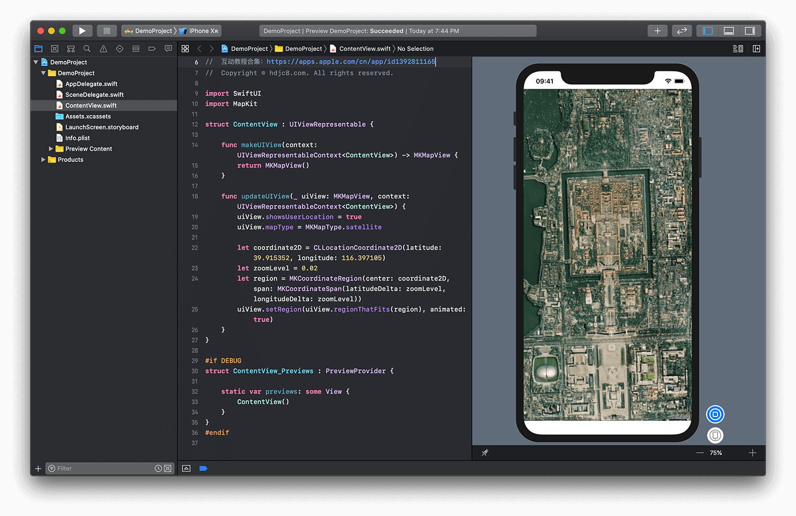
</details>

[](#ExampleNavigator)


<h4 id="30Shape-Circle"> 30: Shape-Circle </h4>
A circle centered on the frame of the view containing it.<br/>
Code:<br/>

```swift
VStack{
    Circle()
    Circle()
	.fill(Color.orange)
	.frame(width: 200, height: 200)
    ZStack {
       Circle().fill(Color.purple)
       Circle().fill(Color.yellow).scaleEffect(0.8)
       Circle().fill(Color.orange).scaleEffect(0.6)
    }
    Rectangle()
    Rectangle()
	.fill(Color.orange)
	.frame(width: 200, height: 200)
    ZStack {
       Rectangle().fill(Color.purple)
	.frame(width: 300, height: 200)

       Rectangle().fill(Color.yellow)
	.frame(width: 300, height: 200)
	.scaleEffect(0.8)

       Rectangle()
	.fill(Color.orange)
	.frame(width: 300, height: 200)
	.scaleEffect(0.6)
    }
}
```

<details close>
  <summary>View the result</summary>
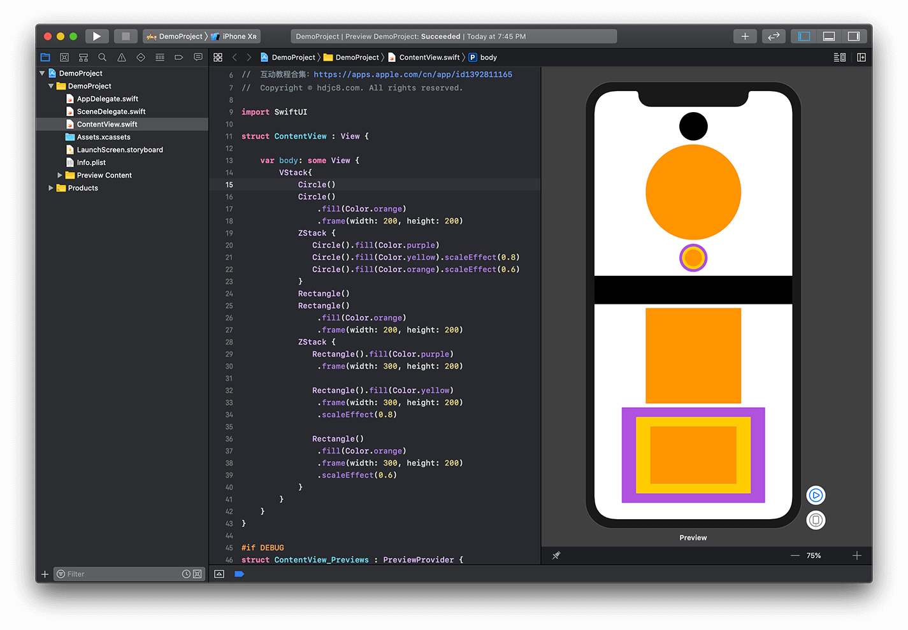
</details>

[](#ExampleNavigator)


<h4 id="31Shape-Rectangle"> 31: Shape-Rectangle </h4>
A rectangular shape aligned inside the frame of the view containing it.<br/>
Code:<br/>

```swift
VStack{
            
    Rectangle()
    Rectangle()
	.fill(Color.orange)
	.frame(width: 200, height: 200)

    ZStack {
       Rectangle().fill(Color.purple)
	.frame(width: 300, height: 200)

       Rectangle().fill(Color.yellow)
	.frame(width: 300, height: 200)
	.scaleEffect(0.8)

       Rectangle()
	.fill(Color.orange)
	.frame(width: 300, height: 200)
	.scaleEffect(0.6)
    }

    RoundedRectangle(cornerRadius: 120)

    RoundedRectangle(cornerSize: CGSize(width: 100, height: 40)).frame(width: 300, height: 200)

    RoundedRectangle(cornerRadius: 100, style: RoundedCornerStyle.continuous)

}
```

<details close>
  <summary>View the result</summary>
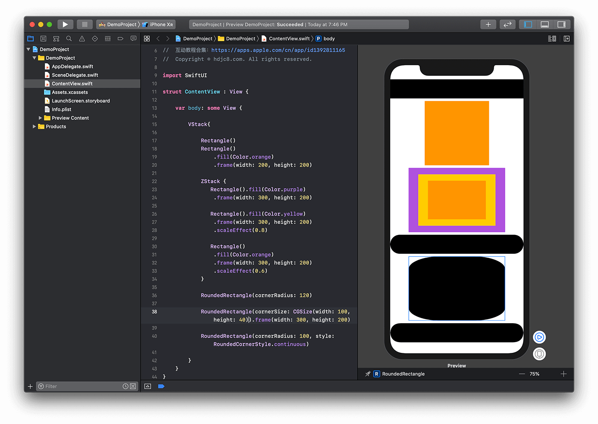
</details>

[](#ExampleNavigator)


<h4 id="32Shape-Path"> 32: 32Shape-Path </h4>
Code Shapes with Paths.<br/>
Code:<br/>

```swift
Path { path in
   path.move(to: CGPoint(x: 30, y: 0))
   path.addLine(to: CGPoint(x: 30, y: 200))
   path.addLine(to: CGPoint(x: 230, y: 200))
    path.addLine(to: CGPoint(x: 230, y: 0))
}

Path { path in
    path.addEllipse(in: CGRect(x: 100, y: 30, width: 200, height: 200))

    path.addRoundedRect(in: CGRect(x: 100, y: 120, width: 200, height: 200), cornerSize: CGSize(width: 10, height: 10))

    path.addEllipse(in: CGRect(x: 100, y: 210, width: 200, height: 200))
}
```

<details close>
  <summary>View the result</summary>
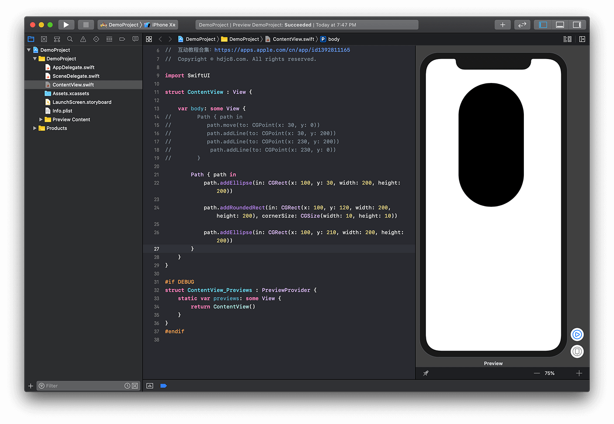
</details>

[](#ExampleNavigator)


<h4 id="33GradientLinear"> 33: LinearGradien </h4>
The gradient applies the color function along an axis, as defined by its start and end points. The gradient maps the unit-space points into the bounding rectangle of each shape filled with the gradient.<br/>
Code:<br/>

```swift
Text("SwifUI Gradient")
    .font(.system(size: 36))
    .padding()
    .foregroundColor(.white)
    .background(LinearGradient(gradient: Gradient(colors: [.orange, .red, .purple]), startPoint: .topLeading, endPoint: .bottomTrailing))

}
```

<details close>
  <summary>View the result</summary>
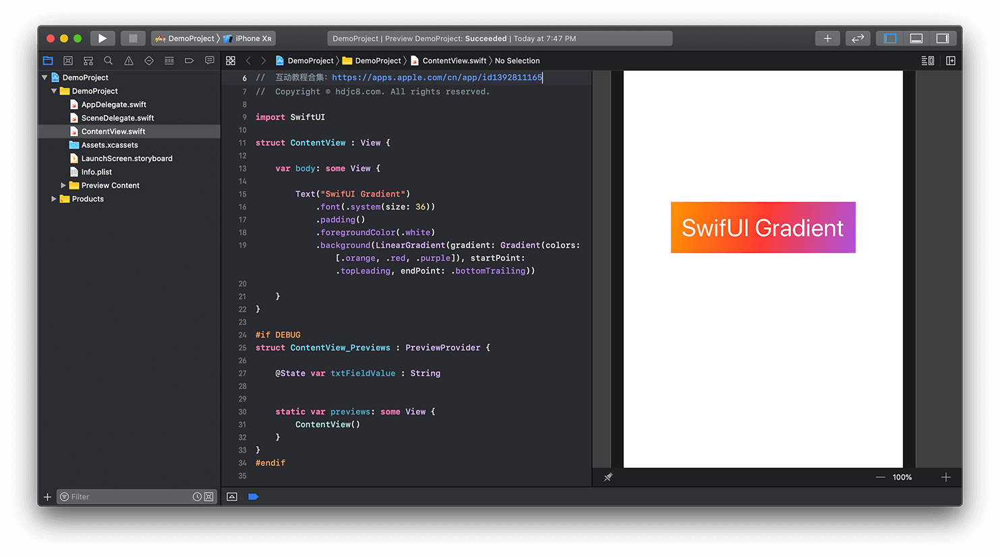
</details>

[](#ExampleNavigator)


<h4 id="34GradientAngular"> 34: AngularGradient </h4>
An angular gradient is also known as a “conic” gradient. This gradient applies the color function as the angle changes, relative to a center point and defined start and end angles.<br/>
Code:<br/>

```swift
VStack{
    Text("SwifUI Gradient")
    .font(.system(size: 36))
    .padding()
    .foregroundColor(.white)
    .background(AngularGradient(gradient: Gradient(colors: [.orange, .red, .purple]), center: UnitPoint(x: 0.5, y: 0.5), angle: Angle.init(degrees: -45)))

    Text("SwifUI Gradient")
    .font(.system(size: 36))
    .padding()
    .foregroundColor(.white)
    .background(AngularGradient(gradient: Gradient(colors: [.orange, .red, .purple]), center: UnitPoint(x: 0.5, y: 0.5), startAngle: Angle.init(degrees: 0), endAngle: Angle.init(degrees: 0)))

}
```

<details close>
  <summary>View the result</summary>
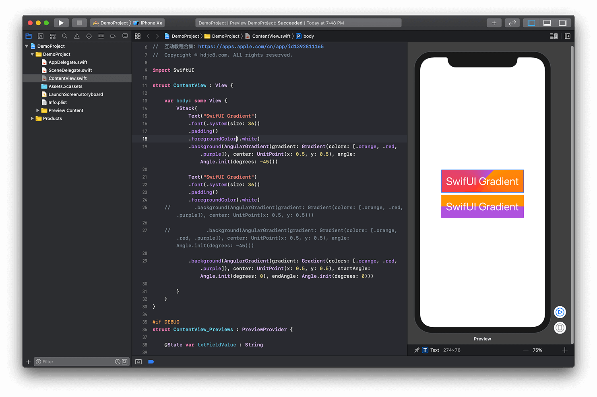
</details>

[](#ExampleNavigator)


<h4 id="35GradientRadial"> 35: RadialGradient </h4>
The gradient applies the color function as the distance from a center point, scaled to fit within the defined start and end radii. The gradient maps the unit-space center point into the bounding rectangle of each shape filled with the gradient.<br/>
Code:<br/>

```swift
Text("SwifUI Gradient")
    .font(.system(size: 36))
    .padding()
    .foregroundColor(.white)
    .background(RadialGradient(gradient: Gradient(colors: [.orange, .red, .purple]), center: .init(x: 0.5, y: 0.5), startRadius: CGFloat(10), endRadius: CGFloat(120)))

}
```

<details close>
  <summary>View the result</summary>
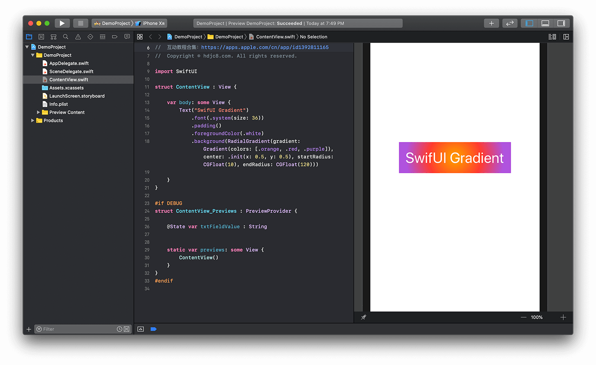
</details>

[](#ExampleNavigator)

#Chapter 2: Animation<br/>
<h4 id="1scaleEffect+default"> 1: scaleEffect+default </h4>
When using SwiftUI, you can individually animate changes to views, or to a view’s state, no matter where the effects are. SwiftUI handles all the complexity of these combined, overlapping, and interruptible animations for you.<br/>
Code:<br/>

```swift
struct ContentView : View {
    
    @State var factor: CGFloat = 1

    var body: some View {
        
        VStack{
            Image("logo")
                .scaleEffect(factor)
                .animation(.default)
            
            Divider().fixedSize()
            
            Button(action: {
                self.factor += 0.2
            }) {
                Text("Zoom in")
            }
        }
    }
}

```

<details close>
  <summary>View the result</summary>
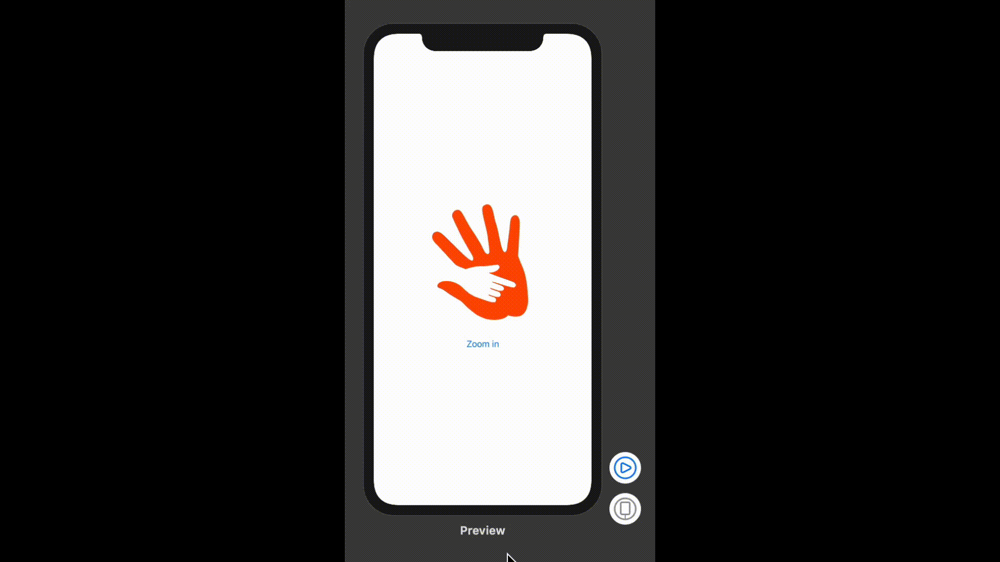
</details>

[](#Chapter2)

<h4 id="2Opacity+linear"> 2: Opacity+linear </h4>
<br/>
Code:<br/>

```swift
struct ContentView : View {
    
    @State var factor: Double = 1
    @State var alpha: Double = 1

    var body: some View {
        Image("logo")
            .scaleEffect(CGFloat(factor))
            .opacity(alpha)
            .onTapGesture {
                withAnimation(.linear(duration: 1.0)) {
                    self.factor += 0.1
                    self.alpha -= 0.2
                }
            }
    }
}
```

<details close>
  <summary>View the result</summary>
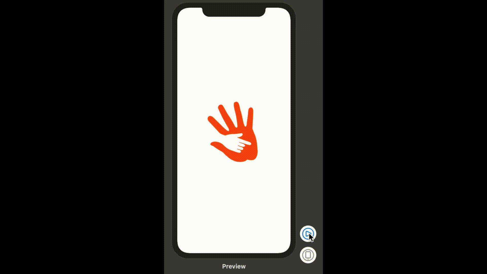
</details>

[](#Chapter2)


<h4 id="3Offset+easeOut"> 3: Offset+easeOut </h4>
<br/>
Code:<br/>

```swift
struct ContentView : View {
    
    @State var distance: Double = 0

    var body: some View {
        VStack{
            Image("logo")
                .offset(x: 0, y: CGFloat(distance))
                .animation(.easeOut(duration: 2))
            
            Divider().fixedSize()
            
            Button(action: {
                self.distance -= 120
            }) {
                Text("Move Effect")
            }
            
        }
        
    }
}
```

<details close>
  <summary>View the result</summary>

</details>

[](#Chapter2)

<h4 id="4RotationEffect+spring"> 4: RotationEffect+spring </h4>
<br/>
Code:<br/>

```swift
struct ContentView : View {
    
    @State var angle: Double = 0

    var body: some View {
        VStack{
            Image("logo")
            .rotationEffect(Angle.init(degrees: angle))
            .animation(.spring())
            
            Divider().fixedSize()
            
            Button(action: {
                self.angle += 90
            }) {
                Text("Rotation Effect")
            }
        }
    }
}
```

<details close>
  <summary>View the result</summary>
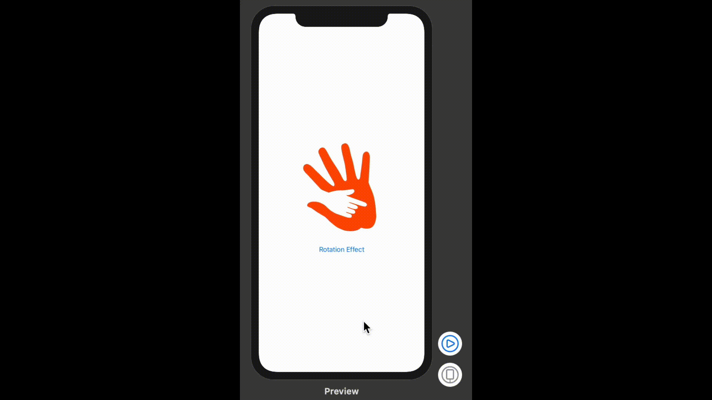
</details>

[](#Chapter2)

<h4 id="5CombinedAnimation"> 5: CombinedAnimation</h4>
<br/>
Code:<br/>

```swift
struct ContentView : View {
    
    @State var radius: Double = 0
    @State var brightness: Double = 0

    var body: some View {
        VStack{
            Image("logo")
                .shadow(radius: CGFloat(radius))
                .brightness(brightness)
                .animation(.linear(duration: 2))
            
            Divider().fixedSize()
            
            Button(action: {
                self.radius += 10
                self.brightness = 1
            }) {
                Text("Move Effect")
            }
            
        }
        
    }
}
```

<details close>
  <summary>View the result</summary>
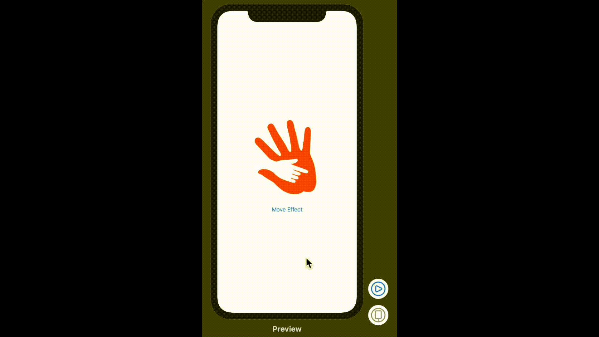
</details>

[](#Chapter2)

<h4 id="6SpeadAndDelay"> 6: SpeadAndDelay </h4>
<br/>
Code:<br/>

```swift
struct ContentView : View {
    @State var factor: Double = 1.0
    
    var animation: Animation {
        Animation.linear(duration: 1)
//            .speed(1)
//            .speed(5)
            .delay(2)
    }

    var body: some View {
        VStack{
            Image("logo")
            .scaleEffect(CGFloat(factor))
            .animation(animation)
            
            Divider().fixedSize()
            
            Button(action: {
                self.factor += 0.2
            }) {
                Text("Zoom In Effect")
            }
        }
    }
}
```

<details close>
  <summary>View the result</summary>

</details>

[](#Chapter2)

<h4 id="7Repeating"> 7: Repeating </h4>
<br/>
Code:<br/>

```swift
struct ContentView : View {
    
    @State var angle: Double = 0
    
    var animation: Animation {
        Animation.spring()
             .repeatForever()
//            .repeatForever(autoreverses: false)
//            .repeatCount(3)
    }

    var body: some View {
        VStack{
            Image("logo")
                .rotationEffect(Angle.init(degrees: angle))
                .animation(animation)
            
            Divider().fixedSize()
            
            Button(action: {
                self.angle += 45
            }) {
                Text("Repeat Forever Effect")
            }
        }
    }
}
```

<details close>
  <summary>View the result</summary>
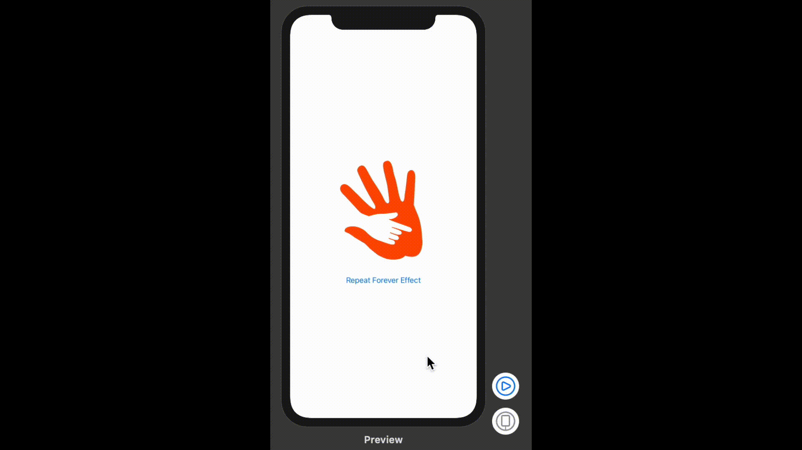
</details>

[](#Chapter2)

<h4 id="8ToggleVisibility"> 8: ToggleVisibility </h4>
<br/>
Code:<br/>

```swift
struct ContentView : View {
    
    @State var showingPassword = false
    @State var password = ""

    var body: some View {
        
        VStack {
            Toggle(isOn: $showingPassword.animation(.spring())) {
                Text("Toggle Password")
            }

            if showingPassword {
                TextField("Password", text: $password)
                    .padding()
                    .border(Color.green, width: 1)
            }
        }
        .padding()
    }
}

```

<details close>
  <summary>View the result</summary>
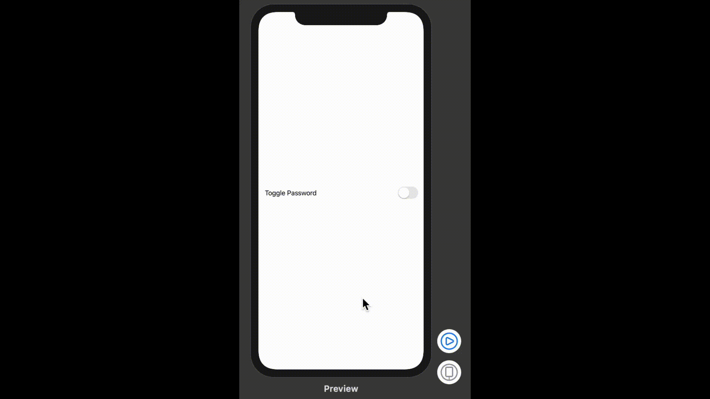
</details>

[](#Chapter2)

<h4 id="9AsymmetricTransition"> 9: AsymmetricTransition </h4>
<br/>
Code:<br/>

```swift
struct ContentView : View {
    @State var showPicture = false

    var body: some View {
        VStack {
            Button(action: {
                withAnimation {
                    self.showPicture.toggle()
                }
            }) {
                Text("Show picture")
            }

            if showPicture {
//                Image("logo")
                
//                Image("logo")
//                    .transition(.move(edge: .top))
                
//                Image("logo")
//                    .transition(.scale(scale: 0))
                
//                Image("logo")
//                    .transition(.slide)
                
//                Image("logo")
//                    .transition(.asymmetric(insertion: .scale(scale: 0), removal: .slide))
                
                Image("logo")
                    .transition(AnyTransition.scale(scale: 0).combined(with:.slide))
            }
        }
    }
}
```

<details close>
  <summary>View the result</summary>
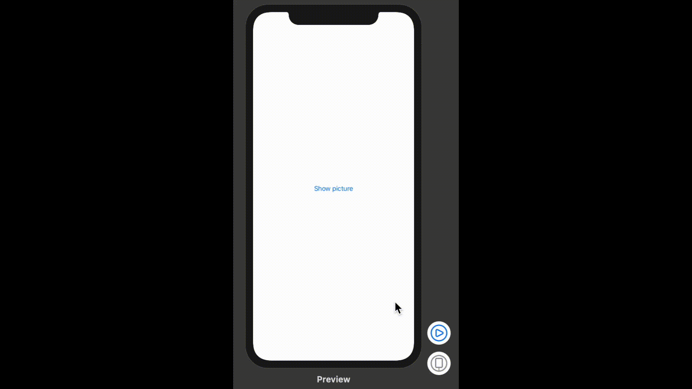
</details>

[](#Chapter2)


# 三章 手势Gesture<br/>
<h4 id="1TapGesture+Singletap"> 1: TapGesture+Single tap </h4>
<br/>
Code:<br/>

```swift
struct ContentView : View {
    
    @State var isPressed = false
    
    var body: some View {
        let tapGesture = TapGesture()
            .onEnded { _ in
                self.isPressed.toggle()
        }
        
        return Circle()
            .fill(Color.orange)
            .frame(width: 240, height: 240)
            .gesture(tapGesture)
            .scaleEffect(isPressed ? 1.4 : 1)
            .animation(.default)
    }
}
```

<details close>
  <summary>View the result</summary>

</details>

[](#Chapter3)

<h4 id="2TapGesture+Doubletap"> 2: TapGesture+Double tap </h4>
<br/>
Code:<br/>

```swift
struct ContentView : View {
    
    @State var isPressed = false
    
    var body: some View {
        
        return Circle()
            .fill(Color.orange)
            .frame(width: 240, height: 240)
            .scaleEffect(isPressed ? 1.4 : 1)
            .animation(.default)
            .onTapGesture(count: 2) {
                self.isPressed.toggle()
                print("Double tap.")
        }
    }
}
```

<details close>
  <summary>View the result</summary>
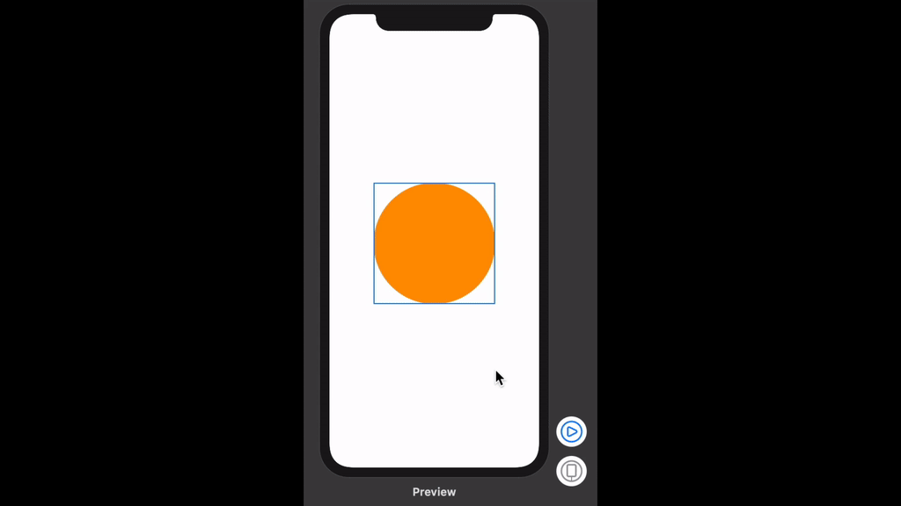
</details>

[](#Chapter3)

<h4 id="3LongPressGesture"> 3: LongPressGesture </h4>
<br/>
Code:<br/>

```swift
struct ContentView : View {
    
    @GestureState var isLongPressed = false
    
    var body: some View {
        let longPressGesture = LongPressGesture()
            .updating($isLongPressed) { value, state, transcation in
                print(value, state, transcation)
                state = value
            }
            .onEnded { (value) in
                print(value)
            }
        
        return Circle()
            .fill(Color.orange)
            .frame(width: 240, height: 240)
            .gesture(longPressGesture)
            .scaleEffect(isLongPressed ? 1.4 : 1)
            .animation(.default)
    }
}
```

<details close>
  <summary>View the result</summary>
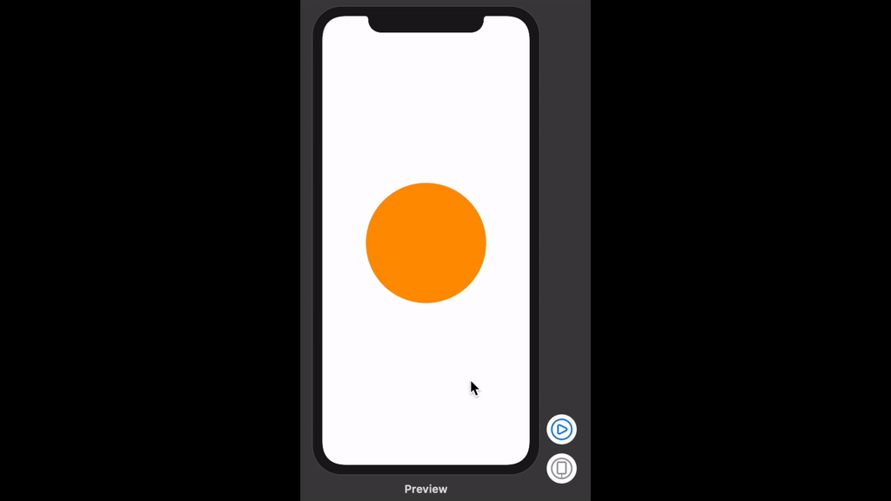
</details>

[](#Chapter3)

<h4 id="4RotationGesture"> 4: RotationGesture </h4>
<br/>
Code:<br/>

```swift
struct ContentView : View {
    
    @State var angle = 0.0
    
    var body: some View {
        let rotationGesture = RotationGesture(minimumAngleDelta: Angle.init(degrees: 20))
            .onChanged({ (angle) in
                
                self.angle += angle.animatableData
            }).onEnded { (angle) in
                print(self.angle)
        }
        
        return Image("logo")
            .gesture(rotationGesture)
            .rotationEffect(Angle.init(degrees: self.angle))
    }
}
```

<details close>
  <summary>View the result</summary>
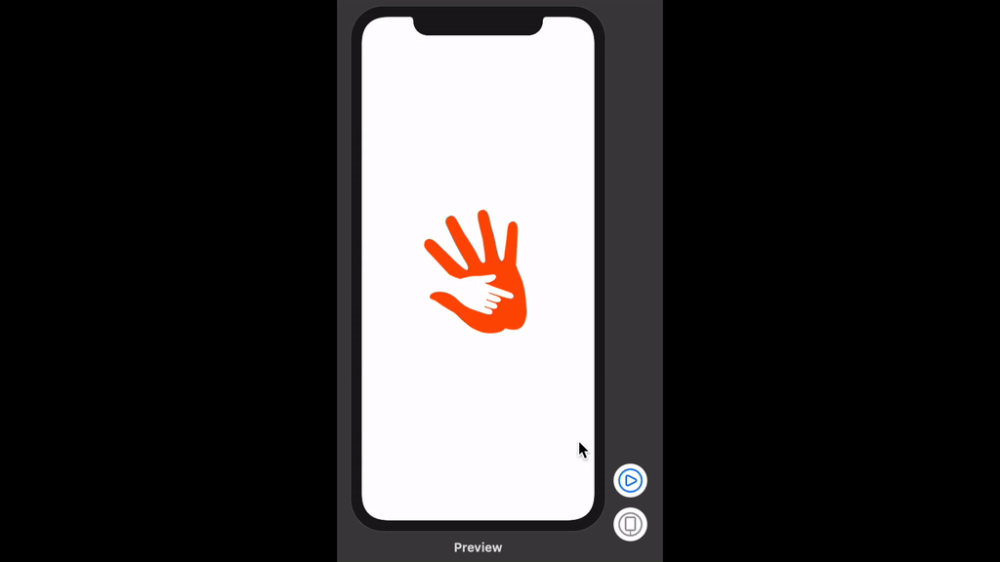
</details>

[](#Chapter3)

<h4 id="5DragGesture"> 5: DragGesture </h4>
<br/>
Code:<br/>

```swift
struct ContentView : View {
    
    @State var offset: CGSize = .zero
    
    var body: some View {
        let dragGesture = DragGesture()
            .onChanged { (value) in
                print(value.startLocation, value.location, value.translation)
                self.offset = value.translation
            }
            .onEnded { (value) in
                if(abs(value.translation.width) >= 40 || abs(value.translation.height - (-260)) >= 40){
                    self.offset = .zero
                }
                else{
                    self.offset = CGSize(width: 0, height: -260)
                }
            }
        
        return VStack{
            Circle()
                .fill(Color.black)
                .opacity(0.1)
                .frame(width: 200, height: 200)
                .offset(CGSize(width: 0, height: -50))
            
            Circle()
                .fill(Color.orange)
                .frame(width: 200, height: 200)
                .offset(offset)
                .gesture(dragGesture)
                .animation(.spring())
        }
        
    }
}
```

<details close>
  <summary>View the result</summary>

</details>

[](#Chapter3)

<h4 id="6LongPressGestureAndDragGesture"> 6: LongPressGestureAndDragGesture </h4>
<br/>
Code:<br/>

```swift
struct ContentView : View {
    
    @State var offset: CGSize = .zero
    @GestureState var isLongPressed = false
    
    var body: some View {
        let longPressGesture = LongPressGesture()
            .updating($isLongPressed) { value, state, transcation in
                print(value, state, transcation)
                state = value
        }
        .onEnded { (value) in
            print(value)
        }
        
        let dragGesture = DragGesture()
            .onChanged { (value) in
                print(value.startLocation, value.location, value.translation)
                self.offset = value.translation
        }
        .onEnded { (value) in
            if(abs(value.translation.width) >= 40 || abs(value.translation.height - (-260)) >= 40){
                self.offset = .zero
            }
            else{
                self.offset = CGSize(width: 0, height: -260)
            }
        }
        .simultaneously(with: longPressGesture)
        
        return VStack{
            Circle()
                .fill(Color.black)
                .opacity(0.1)
                .frame(width: 200, height: 200)
                .offset(CGSize(width: 0, height: -50))
            
            Circle()
                .fill(Color.orange)
                .frame(width: 200, height: 200)
                .offset(offset)
                .gesture(dragGesture)
                .scaleEffect(isLongPressed ? 1.4 : 1)
                .animation(.spring())
        }
        
    }
}
```

<details close>
  <summary>View the result</summary>
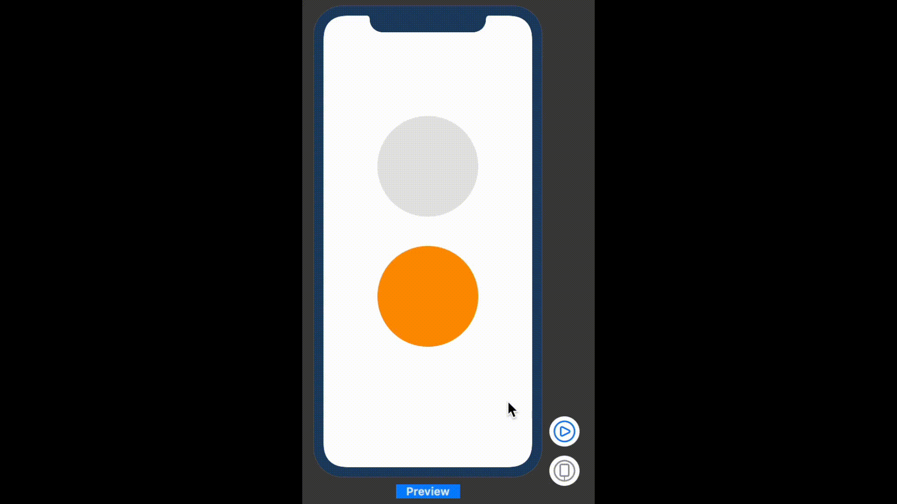
</details>

[](#Chapter3)

# Chapter 4: Layout<br/>
<h4 id="1Group"> 1: Group </h4>
<br/>
Code:<br/>

```swift
struct ContentView : View {
    
    var body: some View {
        Group {
            Text("Apple")
            Text("Banana")
            Text("Orange")
            Text("Watermelon")
            Text("Grape")
            Text("Papaya")
            Text("Pear")
        }
        .font(.title)
        .foregroundColor(.orange)
        .padding()
    }
}
```

<details close>
  <summary>View the result</summary>
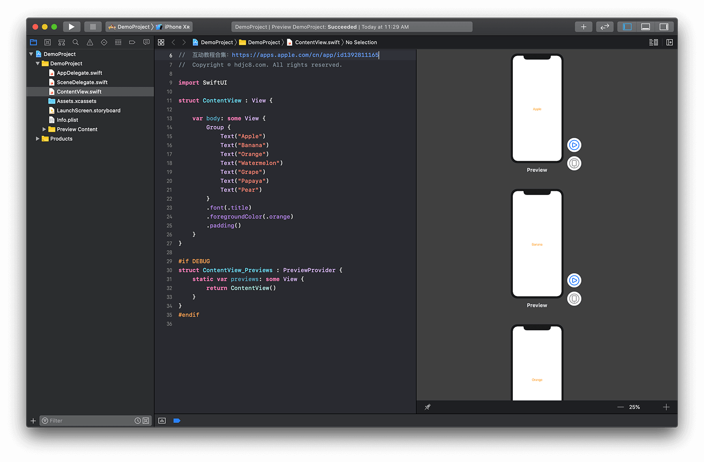
</details>

[](#Chapter4)


<h4 id="2HSTack"> 2: HSTack </h4>
<br/>
Code:<br/>

```swift
struct ContentView : View {
    
    var body: some View {
        HStack(alignment: .bottom, spacing: 40){
            Image(systemName: "book.fill")
            Text("Interactive Tutorials")
            Spacer()
            Image(systemName: "icloud.and.arrow.down")
        }
        .padding()
    }
}
```

<details close>
  <summary>View the result</summary>
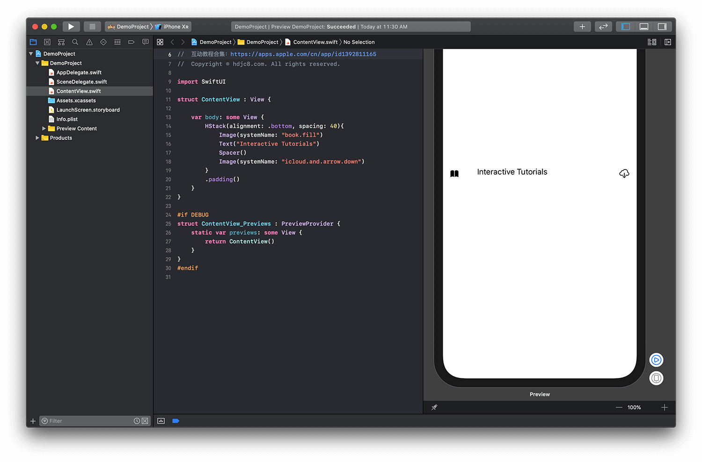
</details>

[](#Chapter4)


<h4 id="3VSTack"> 3: VSTack </h4>
<br/>
Code:<br/>

```swift
struct ContentView : View {
    
    var body: some View {
        VStack{
            Text("The fruit and the tree")
                .font(.largeTitle)
            Image("Apple")
            Text("An apple is a sweet, edible fruit produced by an apple tree Apple trees are cultivated worldwide and are the most widely grown species in the genus Malus.")
                .font(.body)
                .lineLimit(nil)
                .frame(height: 200)
        }.padding()
    }
}
```

<details close>
  <summary>View the result</summary>
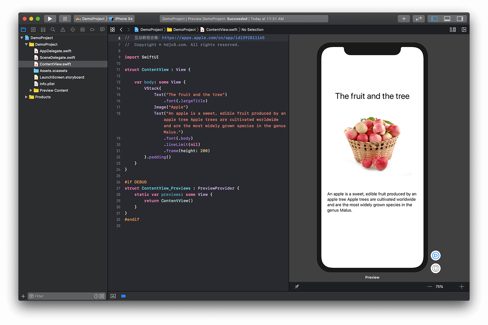
</details>

[](#Chapter4)


<h4 id="4ZSTack"> 4: ZSTack </h4>
<br/>
Code:<br/>

```swift
struct ContentView : View {
    
    var body: some View {
        ZStack(alignment: .center){
            Image("beach").clipShape(Circle())
            Text("Sea beach")
                .font(.system(size: 48))
                .foregroundColor(.white)
            Text("Hawaii - USA")
                .font(.system(size: 14))
                .foregroundColor(.white)
                .offset(x: 0, y: 36)
        }.padding(10)
    }
}
```

<details close>
  <summary>View the result</summary>
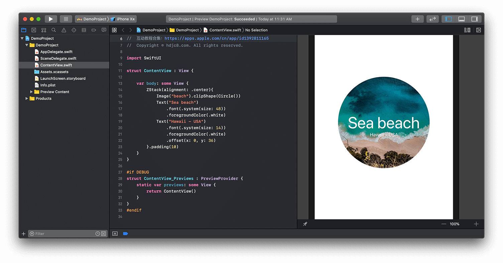
</details>

[](#Chapter4)


<h4 id="5List-Basic"> 5: List-Basic </h4>
<br/>
Code:<br/>

```swift
struct ContentView : View {
    @State var languages = ["Objective-C", "Swift", "Flutter"]

            var body: some View {
                
                List{
                    Text("Objective-C")
                    Text("Swift")
                    Text("Flutter")
                }
                
//                List(0..<5) { item in
//                    Text("Item : \(item)")
//                }
                
//                ForEach(languages, id: \.self) { language in
//                    Text(language)
//                }
            }
}
```

<details close>
  <summary>View the result</summary>
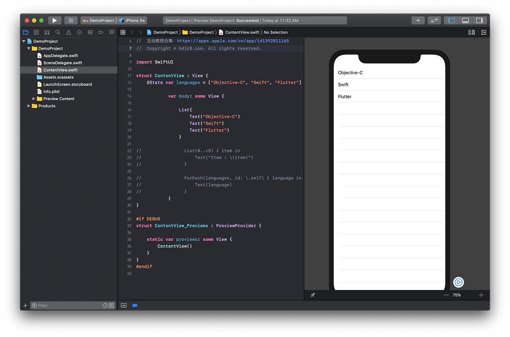
</details>

[](#Chapter4)


<h4 id="6List-Insert"> 6: List-Insert </h4>
<br/>
Code:<br/>

```swift
struct ContentView : View {
    
    @State var languages = ["Objective-C", "Swift", "Flutter"]

    var body: some View {
        NavigationView {
            List {
                ForEach(languages, id:\.self) { language in
                    Text(language)
                }.onInsert(of: ["demo"], perform: { (offset, message) in
                    print(offset)
                })
            }
            .navigationBarTitle(Text("Edit Row"), displayMode: .large)
            .navigationBarItems(trailing: EditButton())
        }.padding()
    }

    func insertItem(to offsets: Int, message : [NSItemProvider]) {
        languages.insert(message[0].description, at: offsets)
    }
    
}
```

<details close>
  <summary>View the result</summary>
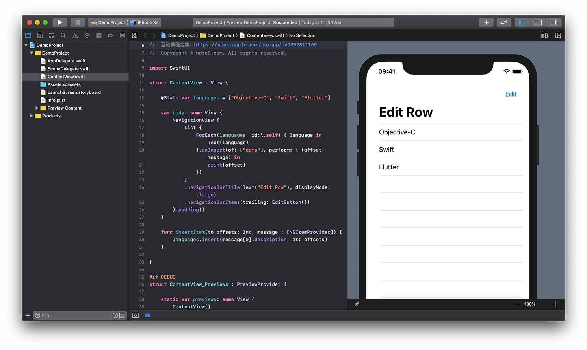
</details>

[](#Chapter4)


<h4 id="7List-Delete"> 7: List-Delete </h4>
<br/>
Code:<br/>

```swift
struct ContentView : View {

        @State var languages = ["Objective-C", "Swift", "Flutter"]

        var body: some View {
            NavigationView {
                List {
                    ForEach(languages,id: \.self) { language in
                        Text(language)
                    }
                    .onDelete(perform: delete)
                }
                .navigationBarItems(trailing: EditButton())
            }
        }

        func delete(at offsets: IndexSet) {
            if let first = offsets.first {
                languages.remove(at: first)
            }
        }
    }
```

<details close>
  <summary>View the result</summary>
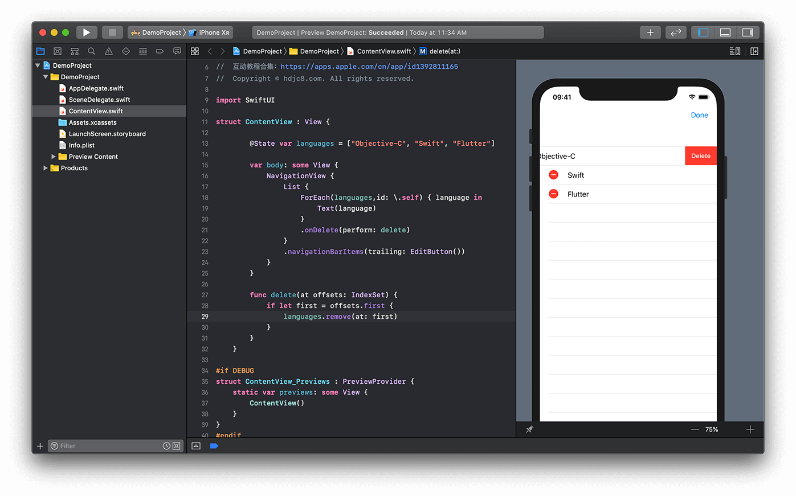
</details>

[](#Chapter4)


<h4 id="8List-Move"> 8: List-Move </h4>
<br/>
Code:<br/>

```swift
struct ContentView : View {
    @State var languages = ["Objective-C", "Swift", "Flutter"]

    var body: some View {
        NavigationView {
            List {
                ForEach(languages,id: \.self) { language in
                    Text(language)
                }
                .onMove { (source, destination) in
                    self.languages.move(fromOffsets: source, toOffset: destination)
                }
            }
            .navigationBarTitle(Text("Edit Row"), displayMode: .large)
            .navigationBarItems(trailing: EditButton())
        }
    }

    func moveItem(from source: IndexSet, to destination: Int) {
        languages.move(fromOffsets: source, toOffset: destination)
        print(languages)
    }
}
```

<details close>
  <summary>View the result</summary>
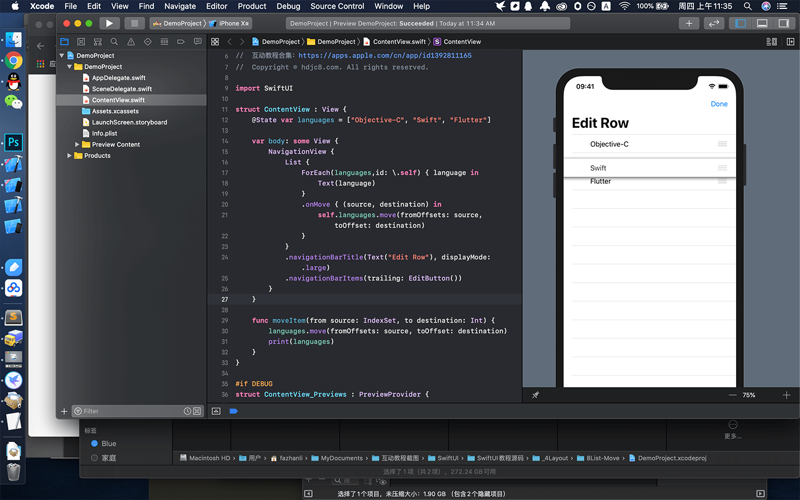
</details>

[](#Chapter4)


<h4 id="9List-DeleteAndMove"> 9: List-DeleteAndMove </h4>
<br/>
Code:<br/>

```swift
struct ContentView : View {
    @State var languages = ["Objective-C", "Swift", "Flutter"]

    var body: some View {
        NavigationView {
            List {
                ForEach(languages, id: \.self) { language in
                    Text(language)
                }
                .onDelete(perform: deleteItem)
                .onMove(perform: moveItem)
            }
            .navigationBarTitle(Text("Edit Row"), displayMode: .large)
            .navigationBarItems(trailing: EditButton())
        }
    }

    func deleteItem(at offsets: IndexSet) {
        if let first = offsets.first {
            languages.remove(at: first)
        }
    }
    
    func moveItem(from source: IndexSet, to destination: Int) {
        languages.move(fromOffsets: source, toOffset: destination)
    }
}
```

<details close>
  <summary>View the result</summary>
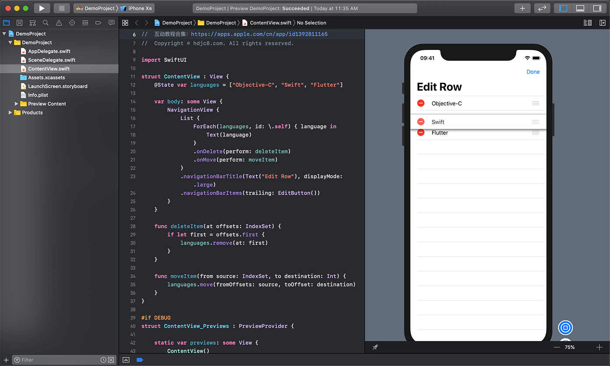
</details>

[](#Chapter4)


<h4 id="10ScrollView-Vertical"> 10: ScrollView-Vertical </h4>
<br/>
Code:<br/>

```swift
struct ContentView : View {
    @State var languages = ["Objective-C", "Swift", "Flutter"]

    var body: some View {
            ScrollView(.vertical, showsIndicators: false) {
                VStack(alignment: HorizontalAlignment.leading, spacing: 20){

                    Text("Overview")
                    .font(.system(size: 48))
                    .padding(10)
                    Text("With the power of Xcode, the ease of Swift, and the revolutionary features of cutting-edge Apple technologies, you have the freedom to create your most innovative apps ever.\nSwiftUI provides views, controls, and layout structures for declaring your app's user interface. The framework provides event handlers for delivering taps, gestures, and other types of input to your app, and tools to manage the flow of data from your app's models down to the views and controls that users will see and interact with.")
                    .lineLimit(nil)
                    .frame(width: 300, height: 240, alignment: .topLeading)
                    .padding(10)
                    
                    Image("iPhone")
                    .resizable()
                    .frame(width: 300, height: 556, alignment: .center)
                }
            }
            .background(Color.orange)
            .padding(10)
            .navigationBarTitle(Text("ScrollView"))
        }
    }
```

<details close>
  <summary>View the result</summary>
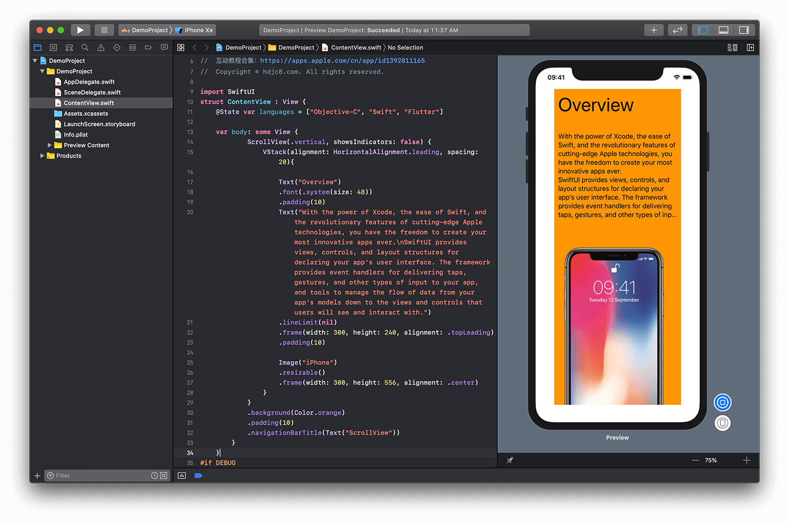
</details>

[](#Chapter4)


<h4 id="11ScrollView-Horizontal"> 11: ScrollView-Horizontal </h4>
<br/>
Code:<br/>

```swift
struct ContentView : View {
    @State var languages = ["Objective-C", "Swift", "Flutter"]

    var body: some View {
            ScrollView(.horizontal, showsIndicators: true) {
                HStack(alignment:.center, spacing: 20){

                    Image("iPhone")
                        .resizable()
                        .frame(width: 300, height: 556, alignment: .center)

                    Image("iPhoneSerial")
                        .resizable()
                        .frame(width: 823, height: 556, alignment: .center)

                    Image("iPhone")
                        .resizable()
                        .frame(width: 300, height: 556, alignment: .center)
                }
            }
            .background(Color.orange)
            .padding(10)
        }
    }
```

<details close>
  <summary>View the result</summary>
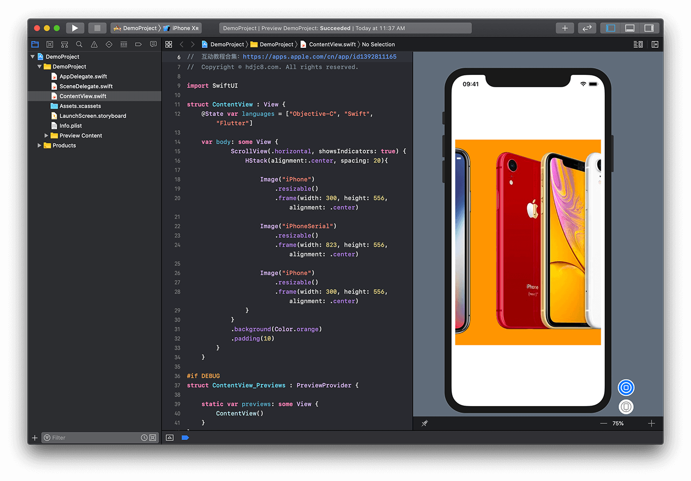
</details>

[](#Chapter4)


<h4 id="12ScrollView-VerticalAndHorizontal"> 12: ScrollView-VerticalAndHorizontal </h4>
<br/>
Code:<br/>

```swift
struct ContentView : View {
    @State var languages = ["Objective-C", "Swift", "Flutter"]

    var body: some View {
        ScrollView(.vertical, showsIndicators: false) {
            VStack(alignment: HorizontalAlignment.leading, spacing: 20){

                Text("Overview")
                .font(.system(size: 48))
                .padding(10)
                Text("With the power of Xcode, the ease of Swift, and the revolutionary features of cutting-edge Apple technologies, you have the freedom to create your most innovative apps ever.\nSwiftUI provides views, controls, and layout structures for declaring your app's user interface. The framework provides event handlers for delivering taps, gestures, and other types of input to your app, and tools to manage the flow of data from your app's models down to the views and controls that users will see and interact with.")
                .lineLimit(nil)
                .frame(width: 300, height: 350, alignment: .topLeading)
                .padding(10)
                
                ScrollView(.horizontal, showsIndicators: true) {
                    HStack(alignment:.center, spacing: 20){

                        Image("iPhone")
                            .resizable()
                            .frame(width: 189, height: 350, alignment: .center)

                        Image("iPhoneSerial")
                            .resizable()
                            .frame(width: 518, height: 350, alignment: .center)

                        Image("iPhone")
                            .resizable()
                            .frame(width: 189, height: 350, alignment: .center)
                    }
                }
                .background(Color.orange)
                .padding(10)
            }
        }
        .background(Color.orange)
        .padding(10)
        .navigationBarTitle(Text("ScrollView"))
    }
}
```

<details close>
  <summary>View the result</summary>
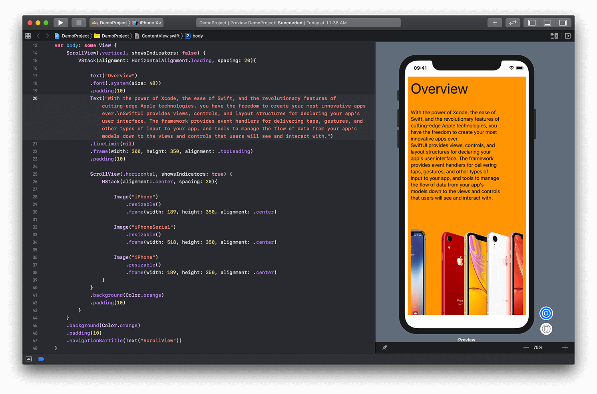
</details>

[](#Chapter4)


<h4 id="13Form-Basic"> 13: Form-Basic </h4>
<br/>
Code:<br/>

```swift
struct ContentView : View {

    private var languages = ["Swift", "Objective-C"]
    @State private var selectedLanguage = 0
    @State var workingYear: Double = 2
    @State var enableNotification = false

    var body: some View {
        NavigationView {
            Form {
                Picker(selection: $selectedLanguage, label: Text("Languages")) {
                   ForEach(0 ..< languages.count) {
                    Text(self.languages[$0]).tag($0)
                   }
                }.pickerStyle(SegmentedPickerStyle())
                HStack{
                    Text("Working years")
                    Slider(value: $workingYear, in: 1...10, step: 1)
                }
                
                Toggle(isOn: $enableNotification) {
                    Text("Enable Notification")
                }

                Button(action: {
                    print("Your programming language: \(self.languages[self.selectedLanguage])")
                    print("Your working years: \(Int(self.workingYear))")
                    print("Enable notification: \(self.enableNotification)")
                }) {
                    Text("Submit")
                }
            }.navigationBarTitle(Text("Profiles"))
        }
    }
}
```

<details close>
  <summary>View the result</summary>
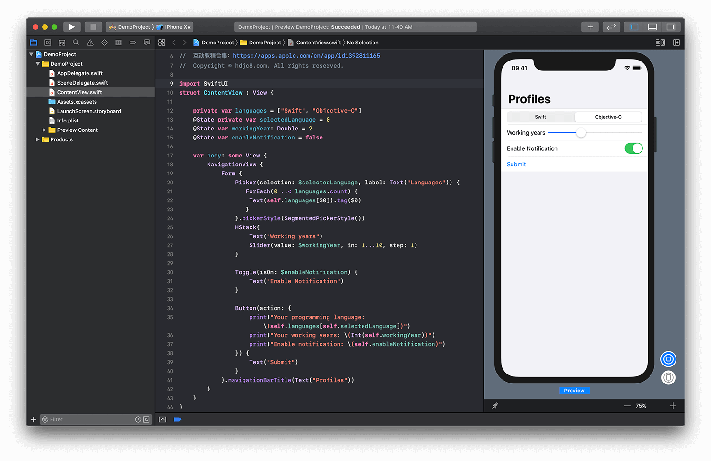
</details>

[](#Chapter4)


<h4 id="14Form-Segment"> 14: Form-Segment </h4>
<br/>
Code:<br/>

```swift
struct ContentView : View {
    private var languages = ["Swift", "Objective-C"]
    @State private var selectedLanguage = 0
    @State var workingYear: Double = 2
    @State var enableNotification = false
    var body: some View {
        NavigationView {
            Form {
                Section(header: Text("Please enter your information:"), footer: Text("Note: Enabling notification to get more infomration")) {
                    Picker(selection: $selectedLanguage, label: Text("Languages")) {
                       ForEach(0 ..< languages.count) {
                        Text(self.languages[$0]).tag($0)
                       }
                    }.pickerStyle(SegmentedPickerStyle())
                    HStack{
                        Text("Working years")
                        Slider(value: $workingYear, in: 1...10, step: 1)
                    }
                    
                    Toggle(isOn: $enableNotification) {
                        Text("Enable Notification")
                    }
                }
                Button(action: {
                // activate theme!
                    print("Your programming language: \(self.languages[self.selectedLanguage])")
                    print("Your working years: \(Int(self.workingYear))")
                    print("Enable notification: \(self.enableNotification)")
                }) {
                    Text("Submit")
                }
            }.navigationBarTitle(Text("Profiles"))
        }
    }
}
```

<details close>
  <summary>View the result</summary>
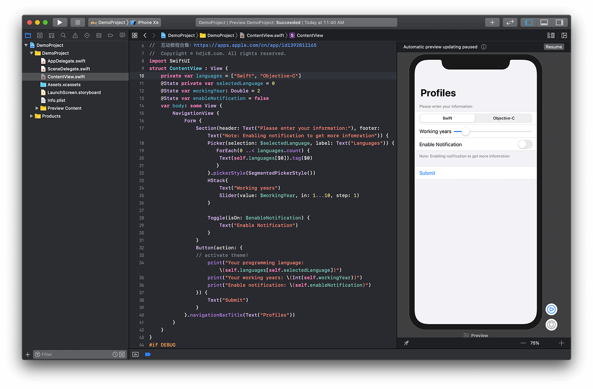
</details>

[](#Chapter4)


<h4 id="15Form-EnableDisable"> 15: Form-EnableDisable </h4>
<br/>
Code:<br/>

```swift
struct ContentView : View {

    @State var enableForm = false
    @State var enableNotification = false
    @State var userName = ""
    @State var password = ""

    var body: some View {
        NavigationView {
            Form {
                Toggle(isOn: $enableForm) {
                    Text("Enable Form")
                }
                
                Section(header: Text("Please enter your information:")) {
                    
                    TextField("Username", text: $userName)
                    SecureField("Password", text: $password)
                    Toggle(isOn: $enableNotification) {
                        Text("Enable Notification")
                    }
                }.disabled(enableForm)
                
            }.navigationBarTitle(Text("Profiles"))
        }
    }
}
```

<details close>
  <summary>View the result</summary>
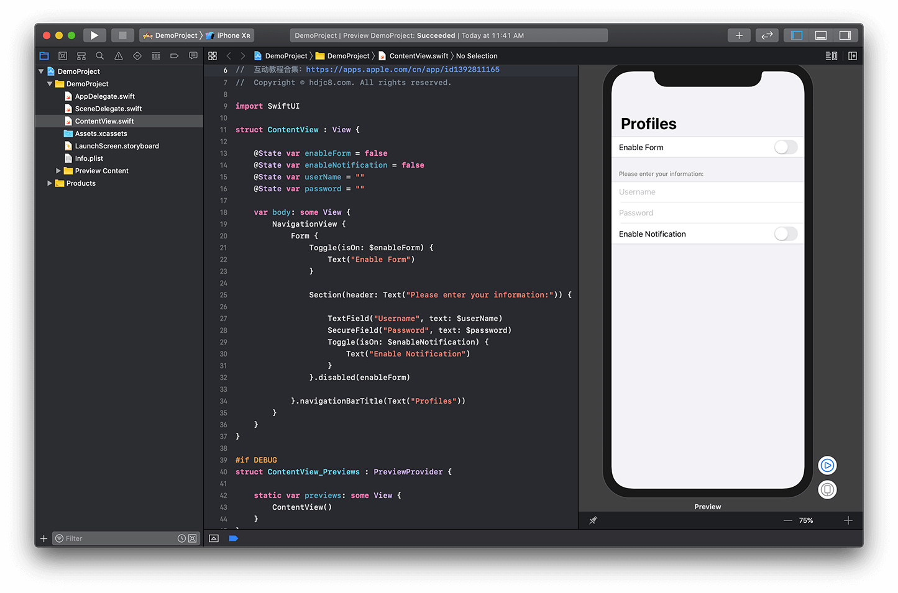
</details>

[](#Chapter4)


<h4 id="16Form-ShowHide"> 16: Form-ShowHide </h4>
<br/>
Code:<br/>

```swift
struct ContentView : View {

    @State var showingVisible = false
    @State var userName = ""
    @State var password = ""

    var body: some View {
        NavigationView {
            Form {
                Toggle(isOn: $showingVisible.animation()) {
                    if(showingVisible){
                        Text("Hide Form")
                    }
                    else{
                        Text("Show Form")
                    }
                }
                
                if(showingVisible)
                {
                    Section(header: Text("Please enter your information:")) {
                        
                        TextField("Username", text: $userName)
                        SecureField("Password", text: $password)
                    }
                }
            }.navigationBarTitle(Text("Profiles"))
        }
    }
}
```

<details close>
  <summary>View the result</summary>
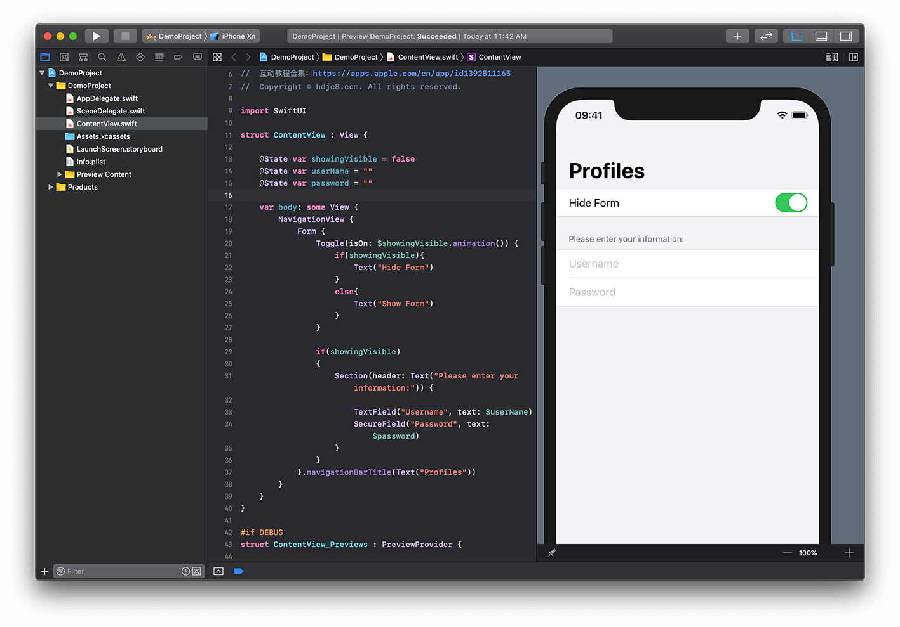
</details>

[](#Chapter4)


# 五章 布局Layout<br/>
<h4 id="1NavigationLink"> 1: NavigationLink </h4>
<br/>
Code:<br/>

```swift
struct ContentView : View {
    
    @State var isPresented = false
    var body: some View {
//            NavigationView {
//                HStack{
//                    NavigationLink(destination: Text("Detail Page #1") ) {
//                        Text("Go detail Page #1 >")
//                    }
//                    .navigationBarTitle("Index Page #1")
//                    .accentColor(Color.orange)
//                }
//            }
        
            NavigationView {
                HStack{
                    NavigationLink(destination: MyDetailView(message: "Detail Page #2") ) {
                        Text("Go detail Page #2 >")
                    }
                    .navigationBarTitle("Index Page #1")
                }
            }
            
    }
}

struct MyDetailView: View {
    
    let message: String

    var body: some View {
        VStack {
            Text(message)
                .font(.largeTitle)
        }
    }
}
```

<details close>
  <summary>View the result</summary>
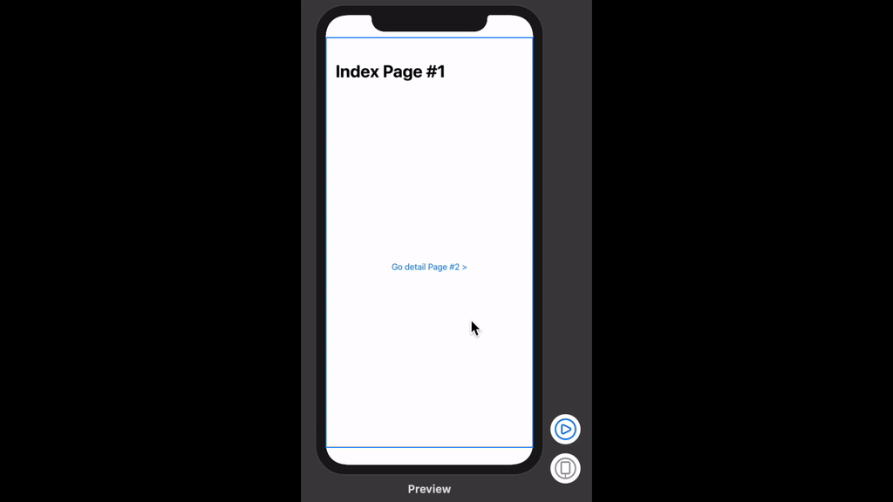
</details>

[](#Chapter5)


<h4 id="2NavigationLinkAndGoBack"> 2: NavigationLinkAndGoBack </h4>
<br/>
Code:<br/>

```swift
struct ContentView : View {
    
    @State private var isPresented = false
    
    var body: some View {
        
//            NavigationView{
//                VStack{
//                Image("Picture").onTapGesture {
//                    self.isPresented.toggle()
//                    print(self.isPresented)
//                }
//                NavigationLink(destination: Text("< Go back").onTapGesture {
//                    self.isPresented.toggle()
//                }, isActive: $isPresented) {
//                    Text("ddd")
//                }
//            }
        
        NavigationView{
            VStack{
                NavigationLink(destination: DetailView(preView: self), isActive: $isPresented) {
                    Image("logo").renderingMode(.original)
                    Text("Next Page >")
                }
            }
        }
    }
    
    func toggleValue()
    {
        self.isPresented.toggle()
    }
}
```

<details close>
  <summary>View the result</summary>
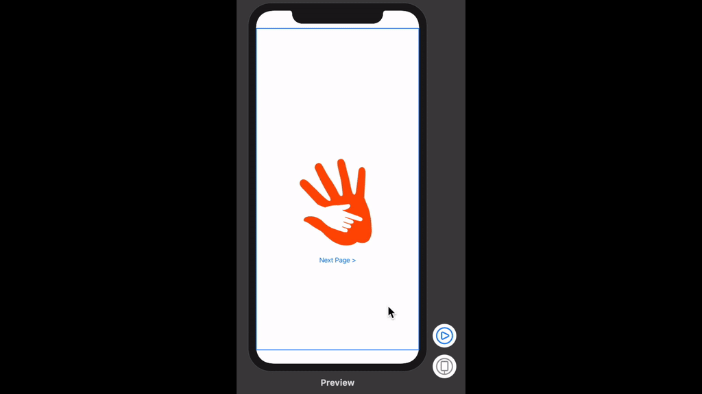
</details>

[](#Chapter5)


<h4 id="3PageNavigation"> 3: PageNavigation </h4>
<br/>
Code:<br/>

```swift
import SwiftUI

struct InfoModel : Hashable {
    var description : String
    var pictureName : String
}
struct ContentView : View {
    
    var messages : [InfoModel]
    
    var body: some View {
        return NavigationView{
            List{
                ForEach(messages, id: \.self) { message in
                    NavigationLink(destination: DetailView(imageName: message.pictureName)) {
                        Text(message.description)
                    }
                }
            }.navigationBarTitle("Picture List")
        }
    }
}
struct DetailView : View {
    var imageName : String
    var body: some View{
        Image(imageName)
    }
}
#if DEBUG
struct ContentView_Previews : PreviewProvider {
    static var previews: some View {
        let model1 = InfoModel(description: "A lady with a horse", pictureName: "Picture1")
        let model2 = InfoModel(description: "An African animal with a very long neck", pictureName: "Picture2")
        return ContentView(messages: [model1, model2])
    }
}
#endif

```

<details close>
  <summary>View the result</summary>
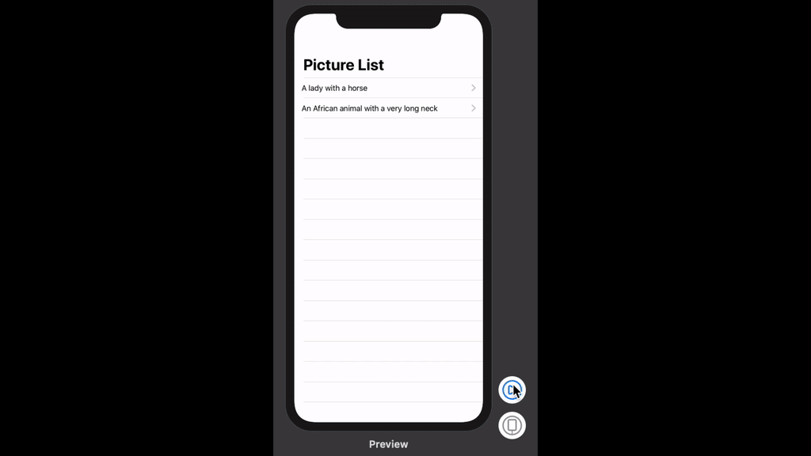
</details>

[](#Chapter5)


<h4 id="4ObjectBinding"> 4: ObjectBinding </h4>
<br/>
Code:<br/>

```swift
class UserModel: ObservableObject {
    @Published var nickName: String = ""
}

struct ContentView : View {
    @ObservedObject var model = UserModel()
    @State var isPresented = false

    let dismiss = Alert.Button.default(Text("OK")) {}
    var alert: Alert {
        Alert(title: Text("Your nickname"),
             message: Text("\(self.model.nickName)"),
             dismissButton: dismiss)
    }
    
    var body: some View {
        VStack {
            TextField("Your nickname", text: $model.nickName)
            .padding()
            
            Button(action: {
                self.isPresented = true
            }) {
                Text("Show")
            }.alert(isPresented: $isPresented) { () -> Alert in
                alert
            }
        }
    }
}
```

<details close>
  <summary>View the result</summary>
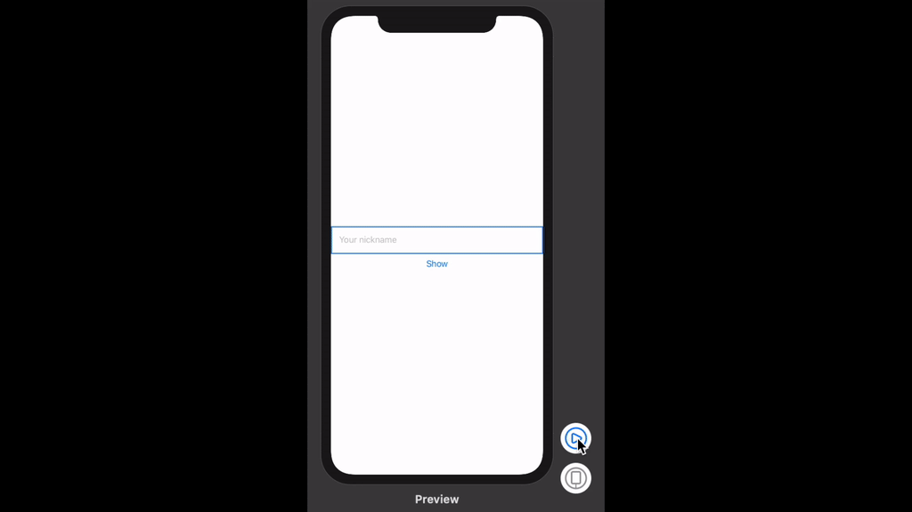
</details>

[](#Chapter5)


<h4 id="5EnviromentObject"> 5: EnviromentObject </h4>
<br/>
Code:<br/>

```swift
import SwiftUI

class UserModel: ObservableObject {
    @Published var nickName: String = ""
}

struct ContentView : View {
    
    @EnvironmentObject var model : UserModel
    @State var isPresented = false
    
    var body: some View {
        NavigationView {

            VStack{
                TextField("Your nickname", text: $model.nickName)
                .padding()
                
                NavigationLink(destination: DetailView()) {
                    Text("Show Detail")
                }
            }
        }
    }
}

#if DEBUG
struct ContentView_Previews : PreviewProvider {
    static var previews: some View {
        let model = UserModel()
        model.nickName = "Super man"
        return ContentView().environmentObject(model)
    }
}
#endif

```

<details close>
  <summary>View the result</summary>
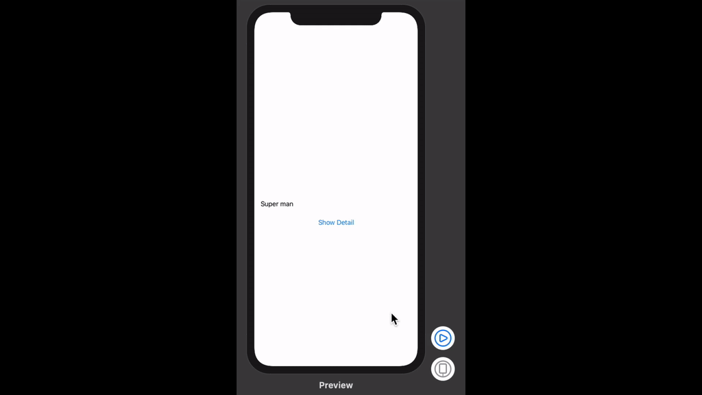
</details>

[](#Chapter5)


<h4 id="6Show_Modal"> 6: Show_Modal </h4>
<br/>
Code:<br/>

```swift
struct ContentView : View {
    
    @State var isPresented = false

    var modalView: some View {
        Text("The Modal View")
            .font(.system(size: 48))
            .bold()
    }

    var body: some View {
        Button("Show Modal View") {
            self.isPresented = true
        }.sheet(isPresented: $isPresented, content: {
            self.modalView
        })
    }
}
```

<details close>
  <summary>View the result</summary>

</details>

[](#Chapter5)


<h4 id="7Show-Alert"> 7: Show-Alert </h4>
<br/>
Code:<br/>

```swift
struct ContentView : View {
    
        @State var isAlert = false

        let primaryButton = Alert.Button.default(Text("Yes")) {
            print("Yes, I'm a student.")
        }
    
        let secondaryButton = Alert.Button.destructive(Text("No")) {
            print("No, I'm not a student.")
        }
        
        var alert: Alert {
            Alert(title: Text("Question"),
                  message: Text("Are you a student?"),
                  primaryButton: primaryButton,
                  secondaryButton: secondaryButton)
        }

        var body: some View {
            VStack {
                Button("Alert Sheet") {
                    self.isAlert = true
                }
            }.alert(isPresented: $isAlert, content: {
                alert
            })

        }
    }
```

<details close>
  <summary>View the result</summary>
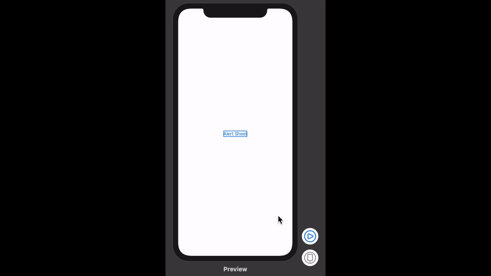
</details>

[](#Chapter5)


<h4 id="8Show-ActionSheet"> 8: Show-ActionSheet </h4>
<br/>
Code:<br/>

```swift
struct ContentView : View {
    
    @State var isPresented = false

    var myActionSheet: ActionSheet {
        ActionSheet(title: Text("Information"),
            message: Text("What's your favorite?"),
            buttons: [
                .default(Text("Fishing")) {
                    print("---I like fishing")
                },
                .destructive(Text("Hunting")) {
                    print("---I like hunting")
                },
                .cancel({
                    print("---Nothing")
                })
            ]
        )
    }

    var body: some View {
        VStack {
            Button("Show action sheet") {
                self.isPresented = true
            }
        }
        .actionSheet(isPresented: $isPresented, content: {
            myActionSheet
        })
    }
}
```

<details close>
  <summary>View the result</summary>

</details>

[](#Chapter5)


# 六章 更多...<br/>
<h4 id="1PreviewInNavigationView"> 1: PreviewInNavigationView </h4>
<br/>
Code:<br/>

```swift
struct ContentView : View {
    var body: some View {
        VStack{
            Image("SwiftUI")
            .navigationBarTitle("About SwiftUI")
            Text("SwiftUI is an innovative, exceptionally simple way to build user interfaces across all Apple platforms with the power of Swift. Build user interfaces for any Apple device using just one set of tools and APIs. With a declarative Swift syntax that’s easy to read and natural to write, SwiftUI works seamlessly with new Xcode design tools to keep your code and design perfectly in sync. Automatic support for Dynamic Type, Dark Mode, localization, and accessibility means your first line of SwiftUI code is already the most powerful UI code you’ve ever written.")
            .padding()
        }
    }
}
```

<details close>
  <summary>View the result</summary>
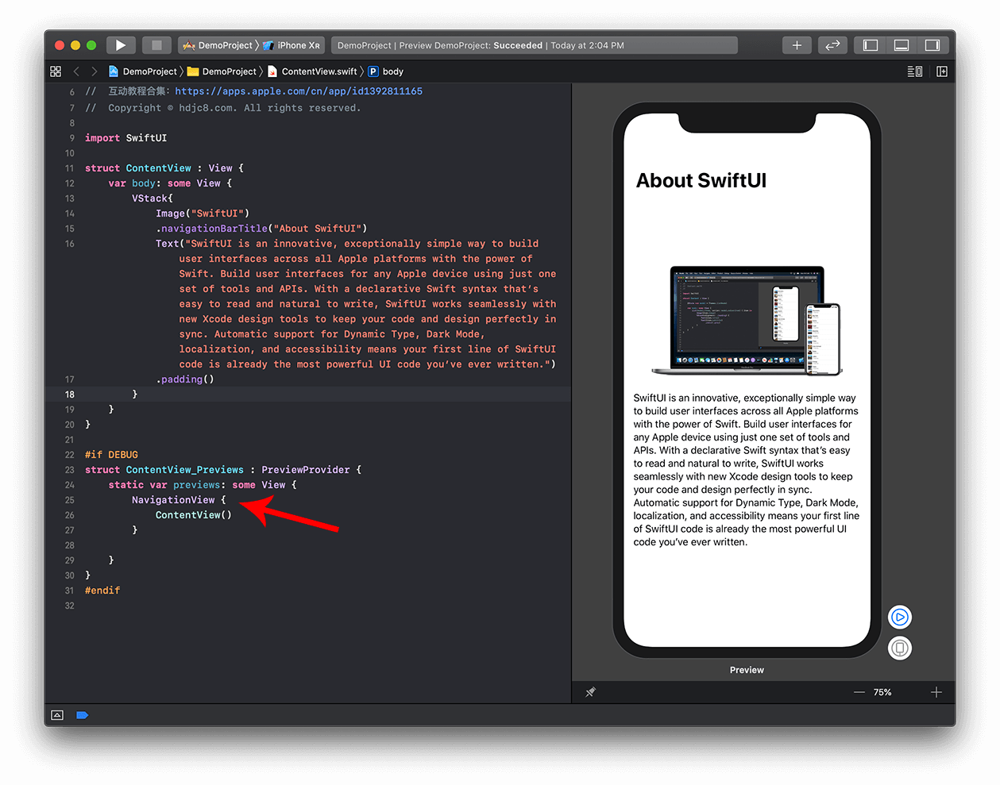
</details>

[](#Chapter6)

<h4 id="2Background"> 2: Background </h4>
<br/>
Code:<br/>

```swift
struct ContentView : View {
    
    var body: some View {
        
        VStack{
            
            Spacer()
            
            Text("SwiftUI Tutorials")
                .font(.largeTitle)
                .padding()
                .background(Color.orange)
            
            Spacer()
            
            Text("SwiftUI Tutorials")
            .font(.largeTitle)
            .padding()
            .background(Image("iPhoneSerial")
                .resizable())
            
            Spacer()
            
            Text("SwiftUI Tutorials")
                .font(.largeTitle)
                .padding()
                .background(Circle()
                    .fill(Color.orange)
                    .frame(width: 280, height: 280))
            
            Spacer()
            
        }

    }
}
```

<details close>
  <summary>View the result</summary>
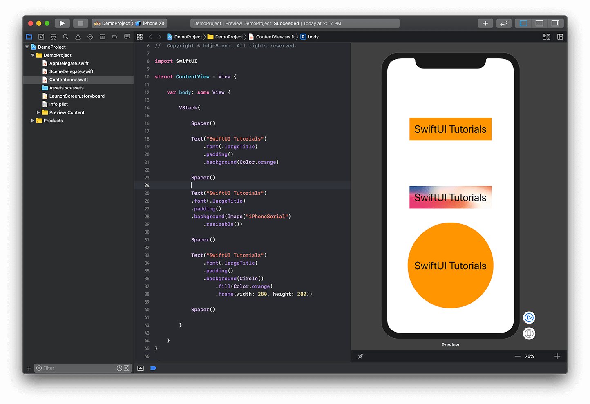
</details>

[](#Chapter6)

<h4 id="3SizeCategory"> 3: SizeCategory </h4>
<br/>
Code:<br/>

```swift
struct ContentView : View {
    var body: some View {
        VStack{
            Text("Dynamic Type sizes")
                .font(.system(size: 36))
            Text("Dynamic Type sizes")
        }
        
    }
}

#if DEBUG
struct ContentView_Previews : PreviewProvider {
    static var previews: some View {
        VStack{
            
            Spacer()
            ContentView()
                .environment(\.sizeCategory, .extraSmall)
            Spacer()
            ContentView()
            Spacer()

            ContentView()
               .environment(\.sizeCategory, .accessibilityExtraExtraExtraLarge)
            
            Spacer()
        }
        
    }
}
#endif
```

<details close>
  <summary>View the result</summary>
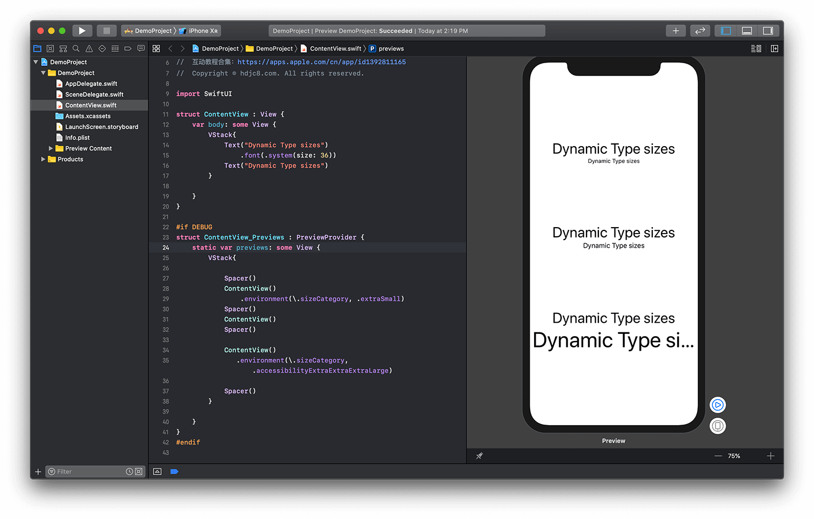
</details>

[](#Chapter6)

<h4 id="4PreviewDevice"> 4: PreviewDevice </h4>
<br/>
Code:<br/>

```swift
struct ContentView : View {
    var body: some View {
        VStack{
            Text("Dynamic Type sizes")
                .font(.system(size: 48))
            Text("Dynamic Type sizes")
        }
        
    }
}

#if DEBUG
struct ContentView_Previews : PreviewProvider {
    static var previews: some View {
        Group {
           ContentView()
              .previewDevice(PreviewDevice(rawValue: "iPhone 8"))
              .previewDisplayName("Device-8")

           ContentView()
              .previewDevice(PreviewDevice(rawValue: "iPhone XS Max"))
              .previewDisplayName("Device-XS Max")
        }
    }
}
#endif

```

<details close>
  <summary>View the result</summary>
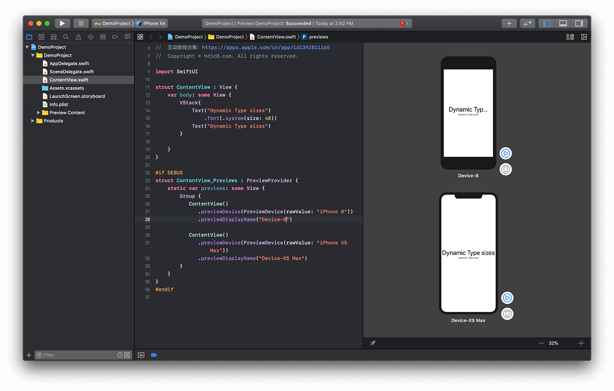
</details>

[](#Chapter6)

<h4 id="5ViewAsProperties"> 5: ViewAsProperties </h4>
<br/>
Code:<br/>

```swift
struct ContentView : View {
    
    let icon = Image(systemName: "book.fill")
    let title = Text("Interactive Tutorials")
    let flag = Image(systemName: "icloud.and.arrow.down")
    
    var body: some View {
        HStack(alignment: .bottom, spacing: 40){
            icon
            title
            Spacer()
            flag
        }
        .padding()
    }
}

```

<details close>
  <summary>View the result</summary>
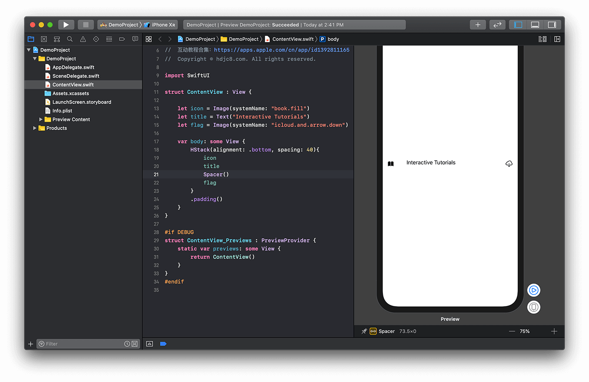
</details>

[](#Chapter6)

<h4 id="6onAppear-onDisappear"> 6: onAppear-onDisappear </h4>
<br/>
Code:<br/>

```swift
struct DetailView: View {
    var body: some View {
        Text("Detail")
        .onAppear {
            print("DetailView appeared!")
        }.onDisappear {
            print("DetailView disappeared!")
        }
    }
}

struct ContentView : View {
    
    @State private var isPresented = false
    
    var body: some View
    {
        Text("Show Detail > ").sheet(isPresented: $isPresented, content: {
            DetailView()
        }).onTapGesture {
            self.isPresented = true
        }.onDisappear {
            print("ContentView disappeared!")
        }.onAppear {
            print("ContentView appeared!")
        }
    }
}
```

<details close>
  <summary>View the result</summary>
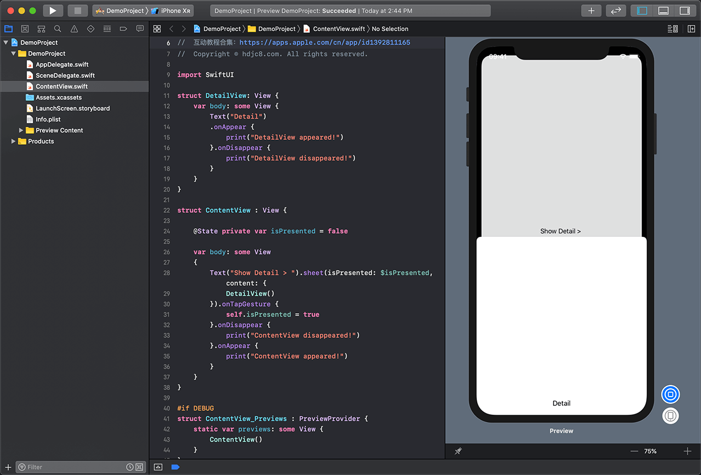
</details>

[](#Chapter6)

<h4 id="7ColorScheme-LightAndDark"> 7: ColorScheme-LightAndDark </h4>
<br/>
Code:<br/>

```swift
struct ContentView : View {
    var body: some View {
        VStack(alignment: .center, spacing: 20){
            Text("Dynamic Type sizes")
                .font(.system(size: 48))
                .foregroundColor(Color.secondary)
            Text("Dynamic Type sizes")
                .foregroundColor(Color.accentColor)
            Image(systemName: "star.fill")
                .foregroundColor(Color.secondary)
                .font(.system(size: 64))
        }
        .frame(minWidth: 0, maxWidth: .infinity, minHeight: 0, maxHeight: .infinity)
        .background(Color.primary)
        .edgesIgnoringSafeArea(.all)
        
    }
}

#if DEBUG
struct ContentView_Previews : PreviewProvider {
    static var previews: some View {
        HStack {
           ContentView()
              .environment(\.colorScheme, .light)

           ContentView()
              .environment(\.colorScheme, .dark)
        }
        
    }
}
#endif

```

<details close>
  <summary>View the result</summary>
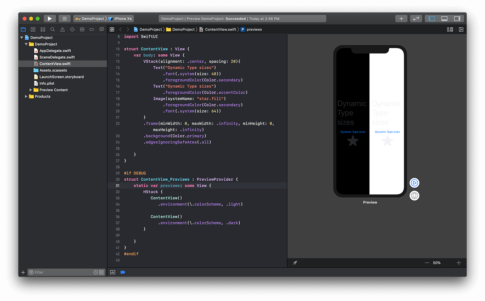
</details>

[](#Chapter6)

<h4 id="8AnyView"> 8: AnyView </h4>
<br/>
Code:<br/>

```swift
struct ContentView : View {
    
    private var randomBool = Bool.random()
    
//    var body: some View {
//        Group {
//            if randomBool {
//                Text("Hi, you get the gift.")
//                    .font(.system(size: 32))
//            } else {
//                Text("Sorry, you miss the gift.")
//                    .font(.system(size: 32))
//            }
//        }
//    }
    
//    var body: some View {
//        if randomBool {
//            return Text("Hi, you get the gift.")
//                .font(.system(size: 32))
//        } else {
//            return Text("Sorry, you miss the gift.")
//                .font(.system(size: 32))
//        }
//    }
    
    var body: AnyView {
        if randomBool {
            return AnyView(Image(systemName: "star.fill").font(.system(size: 72)))
        } else {
            return AnyView(Text("Sorry, you miss the gift.").font(.system(size: 32)))
        }
    }
}

```

<details close>
  <summary>View the result</summary>
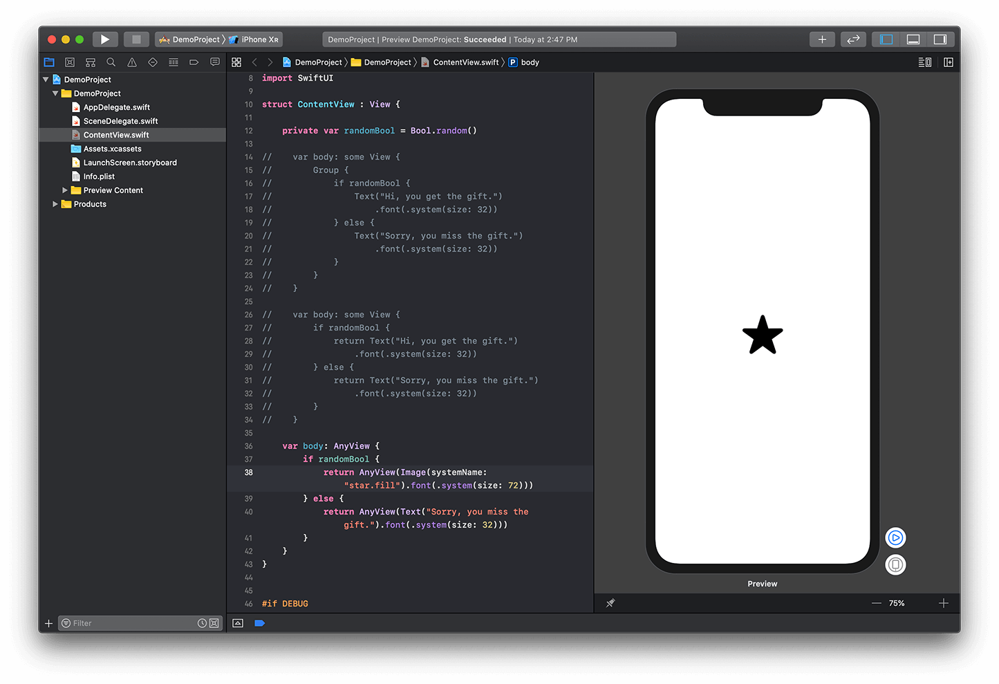
</details>

[](#Chapter6)

<h4 id="9NavigationBarTitle"> 9: NavigationBarTitle </h4>
<br/>
Code:<br/>

```swift
struct ContentView : View {

    var body: some View {
        NavigationView {
            
//            Text("SwiftUI's NavigationView")
            
//            Text("SwiftUI's NavigationView")
//                .navigationBarTitle(Text("SwiftUI"))
            
//            Text("SwiftUI's NavigationView")
//                .navigationBarTitle(Text("SwiftUI"), displayMode: .large)
            
            Text("SwiftUI's NavigationView")
                .navigationBarTitle(Text("SwiftUI"), displayMode: .inline)
        }
    }
}
```

<details close>
  <summary>View the result</summary>
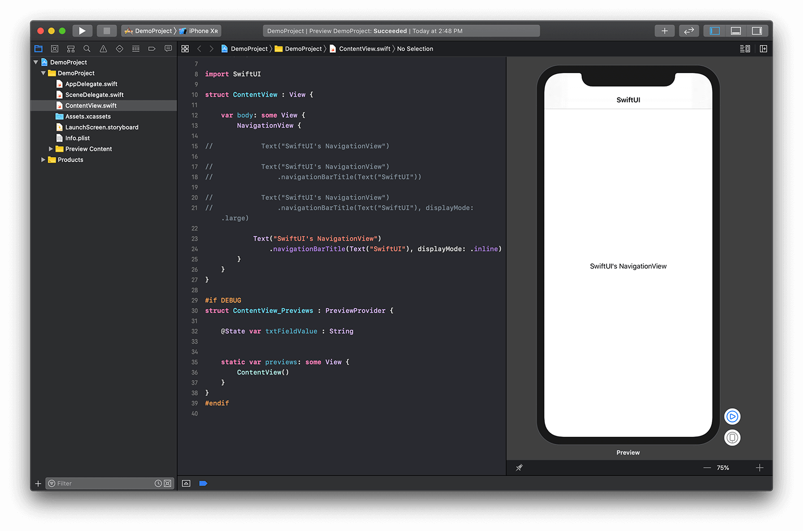
</details>

[](#Chapter6)

<h4 id="10NavigationItem"> 10: NavigationItem </h4>
<br/>
Code:<br/>

```swift
struct TrailingButtons : View{
    var body: some View {
        HStack{
            Button(action: {
                print("Download the data")
            }) {
                Image(systemName: "icloud.and.arrow.down.fill")
            }
            Button(action: {
                print("Edit the data")
            }) {
                Image(systemName: "pencil.tip.crop.circle")
            }
        }
    }
}

struct ContentView : View {

    var body: some View {
        NavigationView {
            Text("SwiftUI's NavigationView")
                .navigationBarTitle(Text("SwiftUI"))
                .navigationBarItems(leading:  Button(action: {
                       print("Go to index page")
                   }) {
                       Text("Index")
                   }, trailing: TrailingButtons())
        }
    }
}
```

<details close>
  <summary>View the result</summary>
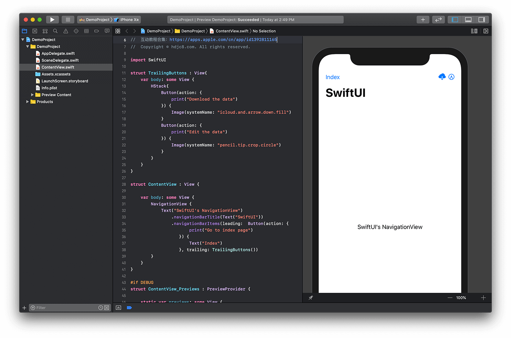
</details>

[](#Chapter6)

<h4 id="11ViewModifier"> 11: ViewModifier </h4>
<br/>
Code:<br/>

```swift
struct ContentView : View {
    
    var body: some View {
        VStack(alignment: .center, spacing: 40){
            Image("avarta1").modifier(myImageStyle())
            Image("avarta2").modifier(myImageStyle())
            Image("avarta3").modifier(myImageStyle())
        }
        .padding()
    }
}

struct myImageStyle: ViewModifier {
    func body(content: Content) -> some View {
        content
            .frame(width: 200, height: 200, alignment: .leading)
            .cornerRadius(100)
            .clipped()
            .saturation(0.0)
    }
}

```

<details close>
  <summary>View the result</summary>
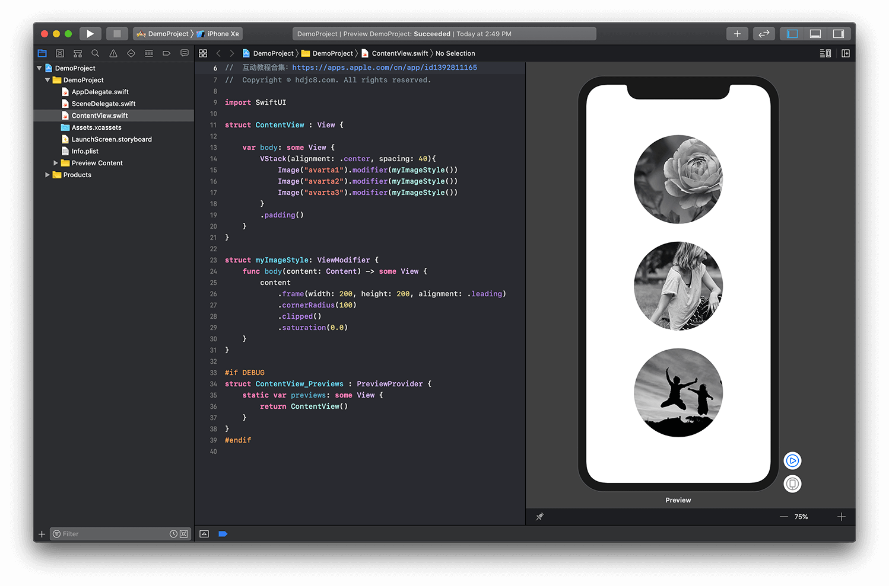
</details>

[](#Chapter6)


<h4 id="swiftuicases"></h4>

# SwiftUI Projects<br/>

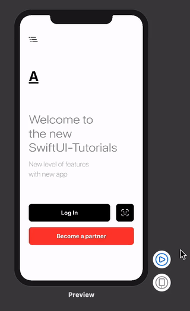<br/><br/>
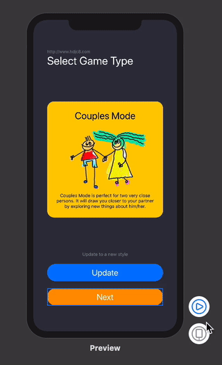<br/><br/>
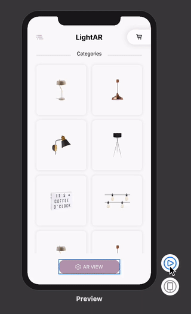<br/><br/>
<br/><br/>
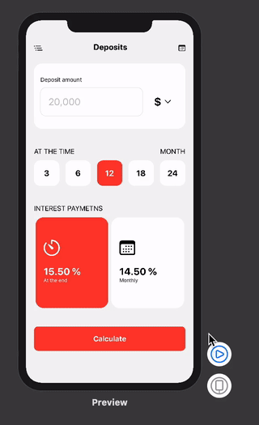<br/><br/>
<br/><br/>
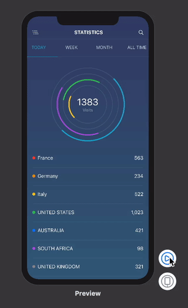<br/><br/>
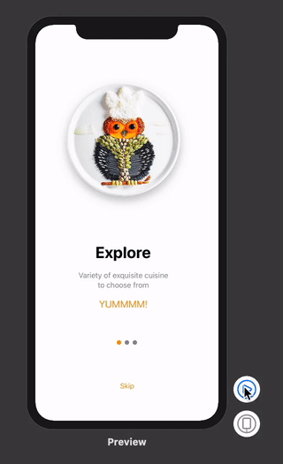<br/><br/>
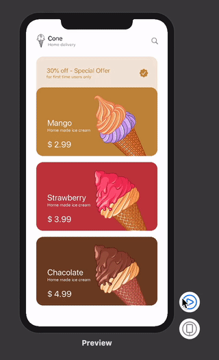<br/><br/>
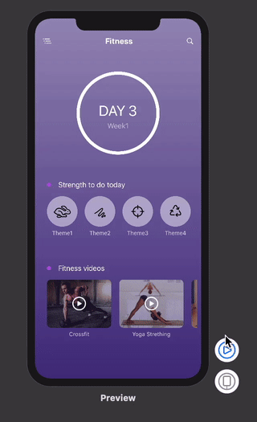<br/><br/>
<br/><br/>

